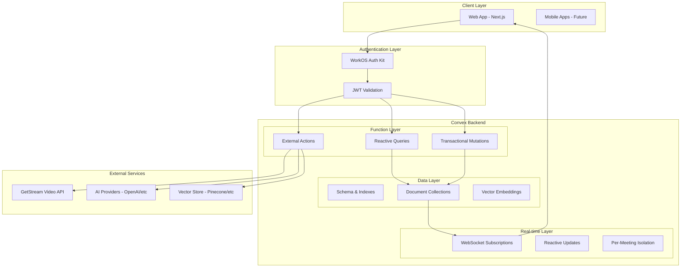

# Design Document

## Overview

This design document outlines the comprehensive migration of LinkedUp's backend from Drizzle ORM + PostgreSQL/Supabase to Convex, a reactive backend-as-a-service platform. The migration enables enterprise-grade real-time features including pre-call idea generation, in-call prompts, collaborative notes, live transcription, and post-call insights while establishing a robust, scalable foundation for future AI-driven enhancements.

The design follows Convex's reactive-first architecture, leveraging TypeScript-first development, WebSocket-based live updates, and strict access controls to deliver sub-100ms real-time experiences for professional networking.

## Architecture

### High-Level Architecture



### Core Principles Implementation

1. **Reactive-First**: All real-time features use Convex reactive queries with WebSocket propagation
2. **TypeScript Everywhere**: End-to-end type safety from schema to client
3. **Least Privilege**: Resource-based ACLs with per-meeting isolation
4. **Write-Optimized**: Append-only logs with time-bucketed sharding
5. **Pluggable Intelligence**: Abstract interfaces for AI and vector providers

## Components and Interfaces

### 1. Authentication & Authorization System

#### WorkOS Integration

```typescript
// convex/auth/workos.ts
export const validateWorkOSJWT = internalQuery({
  args: { token: v.string() },
  returns: v.union(
    v.object({
      valid: v.literal(true),
      userId: v.string(),
      orgId: v.string(),
      orgRole: v.string(),
      email: v.string(),
    }),
    v.object({ valid: v.literal(false) }),
  ),
  handler: async (ctx, { token }) => {
    // JWT validation logic
  },
});
```

#### Access Control Layer

```typescript
// convex/auth/acl.ts
export interface AccessControlContext {
  userId: string;
  orgId: string;
  orgRole: string;
}

export const checkMeetingAccess = internalQuery({
  args: {
    meetingId: v.id("meetings"),
    userId: v.id("users"),
    requiredRole: v.optional(
      v.union(v.literal("host"), v.literal("participant")),
    ),
  },
  returns: v.boolean(),
  handler: async (ctx, { meetingId, userId, requiredRole }) => {
    // Check meetingParticipants table for access
  },
});
```

### 2. Real-Time Subscription System

#### Per-Meeting Data Streams

```typescript
// convex/meetings/streams.ts
export const subscribeMeetingNotes = query({
  args: { meetingId: v.id("meetings") },
  returns: v.object({
    notes: v.string(),
    version: v.number(),
    lastUpdated: v.number(),
  }),
  handler: async (ctx, { meetingId }) => {
    // Validate access via meetingParticipants
    // Return current meeting notes
  },
});

export const subscribeTranscriptStream = query({
  args: {
    meetingId: v.id("meetings"),
    fromSequence: v.optional(v.number()),
  },
  returns: v.array(
    v.object({
      sequence: v.number(),
      speakerId: v.optional(v.string()),
      text: v.string(),
      confidence: v.number(),
      timestamp: v.number(),
    }),
  ),
  handler: async (ctx, { meetingId, fromSequence = 0 }) => {
    // Return transcript chunks since fromSequence
  },
});
```

#### Reactive Query Patterns

```typescript
// convex/meetings/participants.ts
export const getMeetingParticipants = query({
  args: { meetingId: v.id("meetings") },
  returns: v.array(
    v.object({
      userId: v.id("users"),
      role: v.union(v.literal("host"), v.literal("participant")),
      presence: v.union(v.literal("joined"), v.literal("left")),
      joinedAt: v.number(),
      leftAt: v.optional(v.number()),
    }),
  ),
  handler: async (ctx, { meetingId }) => {
    // Return live participant list with presence
  },
});
```

### 3. Meeting Lifecycle Management

#### Stream Integration Actions

```typescript
// convex/meetings/stream.ts
export const createStreamRoom = internalAction({
  args: {
    meetingId: v.id("meetings"),
    participants: v.array(v.id("users")),
  },
  returns: v.object({
    roomId: v.string(),
    tokens: v.record(v.id("users"), v.string()),
  }),
  handler: async (ctx, { meetingId, participants }) => {
    // Call GetStream API to create room
    // Generate participant tokens
    // Store room metadata
  },
});

export const handleStreamWebhook = httpAction(async (ctx, request) => {
  // Verify HMAC signature
  // Process webhook events (participant.joined, call.ended, etc.)
  // Update meetingState and meetingParticipants
});
```

#### Meeting State Management

```typescript
// convex/meetings/lifecycle.ts
export const startMeeting = mutation({
  args: { meetingId: v.id("meetings") },
  returns: v.null(),
  handler: async (ctx, { meetingId }) => {
    // Validate user is host
    // Update meeting state to active
    // Schedule Stream room creation
    // Initialize meeting notes and state
  },
});

export const endMeeting = mutation({
  args: { meetingId: v.id("meetings") },
  returns: v.null(),
  handler: async (ctx, { meetingId }) => {
    // Validate user is host
    // Mark meeting as concluded
    // Schedule post-call processing
    // Trigger transcript aggregation
  },
});
```

### 4. Collaborative Notes System

#### Operational Transform Implementation

```typescript
// convex/notes/operations.ts
export interface NoteOperation {
  type: "insert" | "delete" | "retain";
  position: number;
  content?: string;
  length?: number;
  authorId: string;
  timestamp: number;
  sequence: number;
}

export const applyNoteOperation = mutation({
  args: {
    meetingId: v.id("meetings"),
    operation: v.object({
      type: v.union(
        v.literal("insert"),
        v.literal("delete"),
        v.literal("retain"),
      ),
      position: v.number(),
      content: v.optional(v.string()),
      length: v.optional(v.number()),
    }),
  },
  returns: v.object({
    success: v.boolean(),
    newSequence: v.number(),
    transformedOp: v.optional(v.any()),
  }),
  handler: async (ctx, { meetingId, operation }) => {
    // Validate meeting access
    // Apply operational transform
    // Store in noteOps collection
    // Update materialized meetingNotes
  },
});
```

#### Conflict Resolution

```typescript
// convex/notes/transform.ts
export const transformOperations = internalQuery({
  args: {
    meetingId: v.id("meetings"),
    clientOp: v.any(),
    serverOps: v.array(v.any()),
  },
  returns: v.object({
    transformedOp: v.any(),
    transformedServerOps: v.array(v.any()),
  }),
  handler: async (ctx, { meetingId, clientOp, serverOps }) => {
    // Implement operational transform algorithm
    // Handle concurrent edits with associative transforms
  },
});
```

### 5. Live Transcription System

#### Transcript Ingestion

```typescript
// convex/transcripts/ingestion.ts
export const ingestTranscriptChunk = mutation({
  args: {
    meetingId: v.id("meetings"),
    speakerId: v.optional(v.string()),
    text: v.string(),
    confidence: v.number(),
    startTime: v.number(),
    endTime: v.number(),
  },
  returns: v.null(),
  handler: async (ctx, args) => {
    // Validate meeting is active
    // Calculate time bucket for sharding
    // Store in transcripts collection
    // Trigger real-time updates
  },
});
```

#### Transcript Aggregation

```typescript
// convex/transcripts/aggregation.ts
export const aggregateTranscriptSegments = internalAction({
  args: { meetingId: v.id("meetings") },
  returns: v.null(),
  handler: async (ctx, { meetingId }) => {
    // Fetch raw transcript chunks
    // Group by speaker and time windows
    // Extract topics and sentiment
    // Store in transcriptSegments collection
  },
});
```

### 6. AI Integration Layer

#### Pre-Call Idea Generation

```typescript
// convex/ai/precall.ts
export const generatePreCallIdeas = internalAction({
  args: { meetingId: v.id("meetings") },
  returns: v.array(
    v.object({
      type: v.literal("precall"),
      content: v.string(),
      relevance: v.number(),
      tags: v.array(v.string()),
    }),
  ),
  handler: async (ctx, { meetingId }) => {
    // Fetch participant profiles and interests
    // Call AI provider with deterministic request
    // Generate conversation starters and agendas
    // Store in prompts collection
  },
});
```

#### In-Call Prompt Generation

```typescript
// convex/ai/incall.ts
export const generateContextualPrompts = internalAction({
  args: {
    meetingId: v.id("meetings"),
    context: v.object({
      recentTranscript: v.string(),
      currentTopics: v.array(v.string()),
      lullDetected: v.boolean(),
    }),
  },
  returns: v.array(
    v.object({
      type: v.literal("incall"),
      content: v.string(),
      relevance: v.number(),
      trigger: v.string(),
    }),
  ),
  handler: async (ctx, { meetingId, context }) => {
    // Analyze meeting context and participant expertise
    // Generate contextual conversation prompts
    // Store and stream to participants
  },
});
```

### 7. Intelligent Matching System

#### Queue Management

```typescript
// convex/matching/queue.ts
export const enterMatchingQueue = mutation({
  args: {
    availableFrom: v.number(),
    availableTo: v.number(),
    constraints: v.object({
      interests: v.array(v.string()),
      roles: v.array(v.string()),
      orgConstraints: v.optional(v.string()),
    }),
  },
  returns: v.id("matchingQueue"),
  handler: async (ctx, args) => {
    // Create queue entry
    // Trigger matching algorithm
    // Return queue ID for status tracking
  },
});
```

#### Compatibility Scoring

```typescript
// convex/matching/scoring.ts
export const computeCompatibilityScore = internalQuery({
  args: {
    user1Id: v.id("users"),
    user2Id: v.id("users"),
  },
  returns: v.object({
    score: v.number(),
    factors: v.object({
      sharedInterests: v.number(),
      complementarySkills: v.number(),
      vectorSimilarity: v.number(),
      historicalSuccess: v.number(),
    }),
  }),
  handler: async (ctx, { user1Id, user2Id }) => {
    // Fetch user profiles and embeddings
    // Calculate multi-factor compatibility score
    // Include vector similarity from embeddings
  },
});
```

### 8. Vector Similarity Abstraction

#### Provider-Agnostic Interface

```typescript
// convex/embeddings/interface.ts
export interface VectorProvider {
  generateEmbedding(text: string, metadata: any): Promise<number[]>;
  similaritySearch(
    vector: number[],
    filters: any,
    limit: number,
  ): Promise<SimilarityResult[]>;
}

export const generateEmbeddings = internalAction({
  args: {
    sourceType: v.union(
      v.literal("user"),
      v.literal("profile"),
      v.literal("meeting"),
    ),
    sourceId: v.string(),
    content: v.string(),
  },
  returns: v.object({
    embeddingId: v.id("embeddings"),
    vector: v.array(v.number()),
  }),
  handler: async (ctx, { sourceType, sourceId, content }) => {
    // Call configured vector provider
    // Store embedding with metadata
    // Return embedding ID and vector
  },
});
```

## Data Models

### Core Schema Definitions

```typescript
// convex/schema.ts
import { defineSchema, defineTable } from "convex/server";
import { v } from "convex/values";

export default defineSchema({
  // User Management
  users: defineTable({
    workosUserId: v.string(),
    email: v.string(),
    orgId: v.string(),
    orgRole: v.string(),
    createdAt: v.number(),
    updatedAt: v.number(),
  })
    .index("by_workos_id", ["workosUserId"])
    .index("by_org", ["orgId"])
    .index("by_email", ["email"]),

  profiles: defineTable({
    userId: v.id("users"),
    displayName: v.string(),
    bio: v.optional(v.string()),
    interests: v.array(v.string()),
    goals: v.optional(v.string()),
    languages: v.array(v.string()),
    experience: v.optional(v.string()),
    embeddingId: v.optional(v.id("embeddings")),
    createdAt: v.number(),
    updatedAt: v.number(),
  })
    .index("by_user", ["userId"])
    .index("by_interests", ["interests"])
    .index("by_updated", ["updatedAt"]),

  // Meeting System
  meetings: defineTable({
    organizerId: v.id("users"),
    title: v.string(),
    description: v.optional(v.string()),
    scheduledAt: v.optional(v.number()),
    duration: v.optional(v.number()),
    streamRoomId: v.optional(v.string()),
    state: v.union(
      v.literal("scheduled"),
      v.literal("active"),
      v.literal("concluded"),
      v.literal("cancelled"),
    ),
    createdAt: v.number(),
    updatedAt: v.number(),
  })
    .index("by_organizer", ["organizerId"])
    .index("by_state", ["state"])
    .index("by_scheduled", ["scheduledAt"]),

  meetingParticipants: defineTable({
    meetingId: v.id("meetings"),
    userId: v.id("users"),
    role: v.union(v.literal("host"), v.literal("participant")),
    joinedAt: v.optional(v.number()),
    leftAt: v.optional(v.number()),
    presence: v.union(
      v.literal("invited"),
      v.literal("joined"),
      v.literal("left"),
    ),
    createdAt: v.number(),
  })
    .index("by_meeting", ["meetingId"])
    .index("by_user", ["userId"])
    .index("by_meeting_and_user", ["meetingId", "userId"]),

  meetingState: defineTable({
    meetingId: v.id("meetings"),
    active: v.boolean(),
    startedAt: v.optional(v.number()),
    endedAt: v.optional(v.number()),
    speakingStats: v.optional(v.any()),
    lullState: v.optional(
      v.object({
        detected: v.boolean(),
        lastActivity: v.number(),
        duration: v.number(),
      }),
    ),
    topics: v.array(v.string()),
    recordingEnabled: v.boolean(),
    updatedAt: v.number(),
  })
    .index("by_meeting", ["meetingId"])
    .index("by_active", ["active"]),

  // Collaborative Notes
  meetingNotes: defineTable({
    meetingId: v.id("meetings"),
    content: v.string(),
    version: v.number(),
    lastRebasedAt: v.number(),
    updatedAt: v.number(),
  }).index("by_meeting", ["meetingId"]),

  noteOps: defineTable({
    meetingId: v.id("meetings"),
    sequence: v.number(),
    authorId: v.id("users"),
    operation: v.object({
      type: v.union(
        v.literal("insert"),
        v.literal("delete"),
        v.literal("retain"),
      ),
      position: v.number(),
      content: v.optional(v.string()),
      length: v.optional(v.number()),
    }),
    timestamp: v.number(),
    applied: v.boolean(),
  })
    .index("by_meeting_sequence", ["meetingId", "sequence"])
    .index("by_meeting_timestamp", ["meetingId", "timestamp"]),

  // Transcription System
  transcripts: defineTable({
    meetingId: v.id("meetings"),
    timeBucket: v.string(), // Format: "meetingId_YYYYMMDDHHMM"
    sequence: v.number(),
    speakerId: v.optional(v.string()),
    text: v.string(),
    confidence: v.number(),
    startMs: v.number(),
    endMs: v.number(),
    createdAt: v.number(),
  })
    .index("by_meeting_bucket", ["meetingId", "timeBucket"])
    .index("by_bucket_sequence", ["timeBucket", "sequence"])
    .index("by_meeting_time", ["meetingId", "startMs"]),

  transcriptSegments: defineTable({
    meetingId: v.id("meetings"),
    startMs: v.number(),
    endMs: v.number(),
    speakers: v.array(v.string()),
    text: v.string(),
    topics: v.array(v.string()),
    sentiment: v.optional(v.number()),
    embeddingId: v.optional(v.id("embeddings")),
    createdAt: v.number(),
  })
    .index("by_meeting", ["meetingId"])
    .index("by_meeting_time", ["meetingId", "startMs"])
    .index("by_topics", ["topics"]),

  // AI Prompts and Insights
  prompts: defineTable({
    meetingId: v.id("meetings"),
    type: v.union(v.literal("precall"), v.literal("incall")),
    content: v.string(),
    tags: v.array(v.string()),
    relevance: v.number(),
    usedAt: v.optional(v.number()),
    feedback: v.optional(
      v.union(v.literal("used"), v.literal("dismissed"), v.literal("upvoted")),
    ),
    createdAt: v.number(),
  })
    .index("by_meeting_type", ["meetingId", "type"])
    .index("by_meeting_relevance", ["meetingId", "relevance"]),

  insights: defineTable({
    userId: v.id("users"),
    meetingId: v.id("meetings"),
    summary: v.string(),
    actionItems: v.array(v.string()),
    recommendations: v.array(
      v.object({
        type: v.string(),
        content: v.string(),
        confidence: v.number(),
      }),
    ),
    links: v.array(
      v.object({
        type: v.string(),
        url: v.string(),
        title: v.string(),
      }),
    ),
    createdAt: v.number(),
  })
    .index("by_user", ["userId"])
    .index("by_meeting", ["meetingId"])
    .index("by_user_meeting", ["userId", "meetingId"]),

  // Matching System
  matchingQueue: defineTable({
    userId: v.id("users"),
    availableFrom: v.number(),
    availableTo: v.number(),
    constraints: v.object({
      interests: v.array(v.string()),
      roles: v.array(v.string()),
      orgConstraints: v.optional(v.string()),
    }),
    status: v.union(
      v.literal("waiting"),
      v.literal("matched"),
      v.literal("expired"),
      v.literal("cancelled"),
    ),
    matchedWith: v.optional(v.id("users")),
    createdAt: v.number(),
    updatedAt: v.number(),
  })
    .index("by_user", ["userId"])
    .index("by_status", ["status"])
    .index("by_availability", ["availableFrom", "availableTo"]),

  matchingAnalytics: defineTable({
    userId: v.id("users"),
    matchId: v.string(),
    outcome: v.union(
      v.literal("accepted"),
      v.literal("declined"),
      v.literal("completed"),
    ),
    feedback: v.optional(
      v.object({
        rating: v.number(),
        comments: v.optional(v.string()),
      }),
    ),
    features: v.any(), // Matching features used
    weights: v.any(), // Algorithm weights at time of match
    createdAt: v.number(),
  })
    .index("by_user", ["userId"])
    .index("by_match", ["matchId"])
    .index("by_outcome", ["outcome"]),

  // Vector Embeddings
  embeddings: defineTable({
    sourceType: v.union(
      v.literal("user"),
      v.literal("profile"),
      v.literal("meeting"),
      v.literal("note"),
      v.literal("transcriptSegment"),
    ),
    sourceId: v.string(),
    vector: v.array(v.number()),
    model: v.string(),
    dimensions: v.number(),
    version: v.string(),
    metadata: v.any(),
    createdAt: v.number(),
  })
    .index("by_source", ["sourceType", "sourceId"])
    .index("by_model", ["model"])
    .index("by_created", ["createdAt"]),

  vectorIndexMeta: defineTable({
    provider: v.string(),
    indexName: v.string(),
    config: v.any(),
    status: v.union(
      v.literal("active"),
      v.literal("inactive"),
      v.literal("migrating"),
    ),
    createdAt: v.number(),
    updatedAt: v.number(),
  })
    .index("by_provider", ["provider"])
    .index("by_status", ["status"]),

  // Audit and Observability
  auditLogs: defineTable({
    actorUserId: v.optional(v.id("users")),
    resourceType: v.string(),
    resourceId: v.string(),
    action: v.string(),
    metadata: v.any(),
    ipAddress: v.optional(v.string()),
    userAgent: v.optional(v.string()),
    timestamp: v.number(),
  })
    .index("by_actor", ["actorUserId"])
    .index("by_resource", ["resourceType", "resourceId"])
    .index("by_timestamp", ["timestamp"])
    .index("by_action", ["action"]),

  featureFlags: defineTable({
    key: v.string(),
    value: v.any(),
    environment: v.string(),
    rolloutPercentage: v.number(),
    updatedBy: v.id("users"),
    createdAt: v.number(),
    updatedAt: v.number(),
  })
    .index("by_key", ["key"])
    .index("by_environment", ["environment"])
    .index("by_key_env", ["key", "environment"]),

  // Legacy Support (for migration)
  connections: defineTable({
    requesterId: v.id("users"),
    addresseeId: v.id("users"),
    status: v.union(
      v.literal("pending"),
      v.literal("accepted"),
      v.literal("declined"),
    ),
    createdAt: v.number(),
    updatedAt: v.number(),
  })
    .index("by_requester", ["requesterId"])
    .index("by_addressee", ["addresseeId"])
    .index("by_status", ["status"]),

  messages: defineTable({
    meetingId: v.id("meetings"),
    userId: v.optional(v.id("users")),
    content: v.string(),
    attachments: v.optional(v.array(v.any())),
    timestamp: v.number(),
  })
    .index("by_meeting", ["meetingId"])
    .index("by_meeting_time", ["meetingId", "timestamp"]),

  interests: defineTable({
    key: v.string(),
    label: v.string(),
    category: v.string(),
    createdAt: v.number(),
  })
    .index("by_key", ["key"])
    .index("by_category", ["category"]),
});
```

## Error Handling

### Centralized Error Management

```typescript
// convex/lib/errors.ts
export class ConvexError extends Error {
  constructor(
    public code: string,
    message: string,
    public statusCode: number = 400,
    public metadata?: any,
  ) {
    super(message);
    this.name = "ConvexError";
  }
}

export const ErrorCodes = {
  UNAUTHORIZED: "UNAUTHORIZED",
  FORBIDDEN: "FORBIDDEN",
  NOT_FOUND: "NOT_FOUND",
  VALIDATION_ERROR: "VALIDATION_ERROR",
  MEETING_NOT_ACTIVE: "MEETING_NOT_ACTIVE",
  STREAM_ERROR: "STREAM_ERROR",
  AI_PROVIDER_ERROR: "AI_PROVIDER_ERROR",
} as const;
```

### Retry and Circuit Breaker Patterns

```typescript
// convex/lib/resilience.ts
export const withRetry = async <T>(
  operation: () => Promise<T>,
  maxRetries: number = 3,
  backoffMs: number = 1000,
): Promise<T> => {
  let lastError: Error;

  for (let attempt = 0; attempt <= maxRetries; attempt++) {
    try {
      return await operation();
    } catch (error) {
      lastError = error as Error;
      if (attempt < maxRetries) {
        await new Promise((resolve) =>
          setTimeout(resolve, backoffMs * Math.pow(2, attempt)),
        );
      }
    }
  }

  throw lastError!;
};
```

## Testing Strategy

### Unit Testing Framework

```typescript
// convex/tests/meetings.test.ts
import { convexTest } from "convex-test";
import { api, internal } from "../_generated/api";
import { expect, test, describe } from "vitest";

describe("Meeting Lifecycle", () => {
  test("should create meeting and add participants", async () => {
    const t = convexTest();

    // Create test users
    const userId1 = await t.mutation(api.users.create, {
      workosUserId: "test1",
      email: "test1@example.com",
    });

    // Create meeting
    const meetingId = await t.mutation(api.meetings.create, {
      title: "Test Meeting",
      organizerId: userId1,
    });

    // Verify meeting creation
    const meeting = await t.query(api.meetings.get, { meetingId });
    expect(meeting).toBeDefined();
    expect(meeting.organizerId).toBe(userId1);
  });
});
```

### Integration Testing

```typescript
// convex/tests/realtime.test.ts
describe("Real-time Features", () => {
  test("should stream transcript updates to participants", async () => {
    const t = convexTest();

    // Setup meeting with participants
    const { meetingId, participants } = await setupTestMeeting(t);

    // Start meeting
    await t.mutation(api.meetings.start, { meetingId });

    // Ingest transcript chunk
    await t.mutation(api.transcripts.ingest, {
      meetingId,
      text: "Hello world",
      speakerId: participants[0],
      confidence: 0.95,
    });

    // Verify transcript appears in stream
    const transcripts = await t.query(api.transcripts.getStream, { meetingId });
    expect(transcripts).toHaveLength(1);
    expect(transcripts[0].text).toBe("Hello world");
  });
});
```

### Load Testing

```typescript
// convex/tests/load.test.ts
describe("Performance Tests", () => {
  test("should handle 1000 concurrent transcript updates", async () => {
    const t = convexTest();

    const promises = Array.from({ length: 1000 }, (_, i) =>
      t.mutation(api.transcripts.ingest, {
        meetingId: testMeetingId,
        text: `Message ${i}`,
        confidence: 0.9,
      }),
    );

    const start = Date.now();
    await Promise.all(promises);
    const duration = Date.now() - start;

    expect(duration).toBeLessThan(5000); // 5 second SLO
  });
});
```

## Migration Strategy

### Phase 1: Schema Migration

```typescript
// convex/migrations/001_initial_schema.ts
export const migrateUsers = internalMutation({
  args: {},
  returns: v.null(),
  handler: async (ctx) => {
    // Fetch users from Supabase via action
    const legacyUsers = await ctx.runAction(
      internal.migration.fetchLegacyUsers,
      {},
    );

    // Transform and insert into Convex
    for (const user of legacyUsers) {
      await ctx.db.insert("users", {
        workosUserId: user.clerk_id || user.id,
        email: user.email,
        orgId: user.org_id || "default",
        orgRole: "member",
        createdAt: user.created_at || Date.now(),
        updatedAt: Date.now(),
      });
    }
  },
});
```

### Phase 2: Dual-Write Implementation

```typescript
// convex/migrations/dual_write.ts
export const dualWriteUser = mutation({
  args: { userData: v.any() },
  returns: v.null(),
  handler: async (ctx, { userData }) => {
    // Write to Convex
    const convexId = await ctx.db.insert("users", userData);

    // Schedule write to legacy system
    await ctx.scheduler.runAfter(0, internal.migration.writeLegacyUser, {
      convexId,
      userData,
    });
  },
});
```

### Phase 3: Validation and Cutover

```typescript
// convex/migrations/validation.ts
export const validateDataParity = internalAction({
  args: { sampleSize: v.number() },
  returns: v.object({
    totalChecked: v.number(),
    discrepancies: v.number(),
    errors: v.array(v.string()),
  }),
  handler: async (ctx, { sampleSize }) => {
    // Compare random samples between systems
    // Report discrepancies for manual review
  },
});
```

## Performance Optimization

### Batching and Coalescing

```typescript
// convex/lib/batching.ts
export const batchTranscriptWrites = internalMutation({
  args: {
    meetingId: v.id("meetings"),
    chunks: v.array(v.any()),
  },
  returns: v.null(),
  handler: async (ctx, { meetingId, chunks }) => {
    // Batch multiple transcript chunks into single transaction
    const timeBucket = generateTimeBucket(meetingId, Date.now());

    for (const chunk of chunks) {
      await ctx.db.insert("transcripts", {
        meetingId,
        timeBucket,
        ...chunk,
      });
    }
  },
});
```

### Caching Strategy

```typescript
// convex/lib/caching.ts
export const getCachedUserProfile = query({
  args: { userId: v.id("users") },
  returns: v.any(),
  handler: async (ctx, { userId }) => {
    // Convex handles caching automatically
    // Focus on efficient queries with proper indexes
    return await ctx.db
      .query("profiles")
      .withIndex("by_user", (q) => q.eq("userId", userId))
      .unique();
  },
});
```

### Index Optimization

```typescript
// Optimized queries using compound indexes
export const getMeetingActivity = query({
  args: {
    meetingId: v.id("meetings"),
    fromTime: v.number(),
  },
  returns: v.any(),
  handler: async (ctx, { meetingId, fromTime }) => {
    // Uses compound index "by_meeting_time"
    return await ctx.db
      .query("transcripts")
      .withIndex("by_meeting_time", (q) =>
        q.eq("meetingId", meetingId).gte("startMs", fromTime),
      )
      .collect();
  },
});
```

## Security Considerations

### Input Validation

```typescript
// convex/lib/validation.ts
export const validateMeetingInput = (input: any) => {
  const schema = v.object({
    title: v.string(),
    description: v.optional(v.string()),
    scheduledAt: v.optional(v.number()),
    participants: v.array(v.id("users")),
  });

  return schema.parse(input);
};
```

### Rate Limiting

```typescript
// convex/lib/rate_limiting.ts
export const checkRateLimit = internalQuery({
  args: {
    userId: v.id("users"),
    action: v.string(),
    windowMs: v.number(),
    maxRequests: v.number(),
  },
  returns: v.boolean(),
  handler: async (ctx, { userId, action, windowMs, maxRequests }) => {
    // Implement sliding window rate limiting
    // Store in auditLogs or separate rate limit collection
  },
});
```

### Data Encryption

```typescript
// convex/lib/encryption.ts
export const encryptSensitiveData = (data: string): string => {
  // Use Convex environment variables for encryption keys
  // Implement field-level encryption for PII
  return encryptedData;
};
```

## Monitoring and Observability

### Metrics Collection

```typescript
// convex/lib/metrics.ts
export const recordMetric = internalMutation({
  args: {
    metric: v.string(),
    value: v.number(),
    tags: v.record(v.string(), v.string()),
    timestamp: v.number(),
  },
  returns: v.null(),
  handler: async (ctx, { metric, value, tags, timestamp }) => {
    // Store metrics for analysis
    // Could integrate with external monitoring
  },
});
```

### Distributed Tracing

```typescript
// convex/lib/tracing.ts
export const withTracing = <T>(
  operation: string,
  fn: () => Promise<T>,
): Promise<T> => {
  const traceId = generateTraceId();
  const start = Date.now();

  return fn().finally(() => {
    const duration = Date.now() - start;
    // Log trace information
  });
};
```

## Deployment and Environment Management

### Environment Configuration

```typescript
// convex/lib/config.ts
export const getConfig = () => ({
  workos: {
    apiKey: process.env.WORKOS_API_KEY!,
    clientId: process.env.WORKOS_CLIENT_ID!,
  },
  stream: {
    apiKey: process.env.STREAM_API_KEY!,
    secret: process.env.STREAM_SECRET!,
  },
  ai: {
    openaiKey: process.env.OPENAI_API_KEY!,
    model: process.env.AI_MODEL || "gpt-4",
  },
  vector: {
    provider: process.env.VECTOR_PROVIDER || "convex",
    pineconeKey: process.env.PINECONE_API_KEY,
  },
});
```

### Feature Flags

```typescript
// convex/lib/feature_flags.ts
export const getFeatureFlag = query({
  args: {
    key: v.string(),
    environment: v.string(),
    userId: v.optional(v.id("users")),
  },
  returns: v.any(),
  handler: async (ctx, { key, environment, userId }) => {
    const flag = await ctx.db
      .query("featureFlags")
      .withIndex("by_key_env", (q) =>
        q.eq("key", key).eq("environment", environment),
      )
      .unique();

    if (!flag) return null;

    // Implement rollout logic based on userId hash
    return flag.value;
  },
});
```

This comprehensive design provides a robust foundation for migrating LinkedUp to Convex while implementing advanced real-time features. The architecture emphasizes scalability, security, and maintainability while following Convex best practices for reactive, TypeScript-first development.
