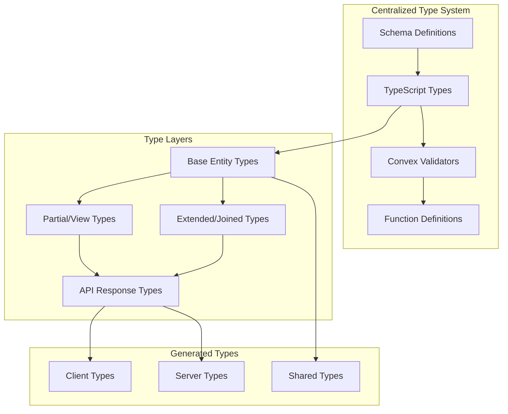

# Convex Type Consistency Design Document

## Overview

s design document outlines the technical approach for establishing a comprehensive, centralized type system across the LinkedUp Convex backend. The goal is to eliminate type duplication, ensure consistency, and improve developer experience while maintaining full type safety.

## Architecture

### Current State Analysis

The current Convex backend suffers from several type-related issues:

1. **Inline Type Definitions**: Each function defines return types inline using `v.object()` patterns
2. **Type Duplication**: Similar entities (User, Meeting, etc.) are redefined with variations across functions
3. **Inconsistent Shapes**: Functions returning the same entity type have different field combinations
4. **Maintenance Overhead**: Schema changes require updates in multiple locations
5. **Poor Developer Experience**: No autocomplete or type safety for entity properties

### Target Architecture



## Design Principles

1. **Single Source of Truth**: All entity types defined in one centralized location
2. **Type Derivation**: Derive Convex validators from TypeScript types, not vice versa
3. **Layered Types**: Base types, partial views, extended joins, and API responses
4. **Compile-Time Safety**: Full TypeScript checking with no runtime overhead
5. **Incremental Migration**: Safe, step-by-step refactoring without breaking changes
6. **Developer Experience**: Excellent autocomplete, error messages, and documentation

## Implementation Strategy

### Phase 1: Centralized Type Definitions

Create a comprehensive type system in `convex/types/` directory:

```
convex/types/
├── entities/           # Base entity types
│   ├── user.ts
│   ├── meeting.ts
│   ├── transcript.ts
│   └── index.ts
├── validators/         # Convex validators derived from types
│   ├── user.ts
│   ├── meeting.ts
│   └── index.ts
├── api/               # API response types
│   ├── responses.ts
│   └── index.ts
└── index.ts           # Main exports
```

### Phase 2: Type Generation System

Implement a system to generate Convex validators from TypeScript types:

```typescript
// convex/types/generators/validator.ts
import { v } from "convex/values";
import type { User, Meeting } from "../entities";

// Generate validators that match TypeScript types exactly
export const userValidator = v.object({
  _id: v.id("users"),
  workosUserId: v.string(),
  email: v.string(),
  orgId: v.optional(v.string()),
  orgRole: v.optional(v.string()),
  displayName: v.optional(v.string()),
  avatarUrl: v.optional(v.string()),
  isActive: v.boolean(),
  lastSeenAt: v.optional(v.number()),
  onboardingComplete: v.optional(v.boolean()),
  createdAt: v.number(),
  updatedAt: v.number(),
}) satisfies ConvexValidator<User>;
```

### Phase 3: Function Refactoring

Systematically refactor all functions to use centralized types:

```typescript
// Before (inline types)
export const getUserById = query({
  args: { userId: v.id("users") },
  returns: v.union(
    v.object({
      _id: v.id("users"),
      workosUserId: v.string(),
      email: v.string(),
      // ... repeated type definition
    }),
    v.null(),
  ),
  handler: async (ctx, { userId }) => {
    return await ctx.db.get(userId);
  },
});

// After (centralized types)
export const getUserById = query({
  args: { userId: v.id("users") },
  returns: v.union(UserValidators.full, v.null()),
  handler: async (ctx, { userId }): Promise<User | null> => {
    return await ctx.db.get(userId);
  },
});
```

## Detailed Design

### 1. Base Entity Types

Define comprehensive TypeScript interfaces for all entities:

```typescript
// convex/types/entities/user.ts
import type { Id } from "../../_generated/dataModel";

export interface User {
  _id: Id<"users">;
  workosUserId: string;
  email: string;
  orgId?: string;
  orgRole?: string;
  displayName?: string;
  avatarUrl?: string;
  isActive: boolean;
  lastSeenAt?: number;
  onboardingComplete?: boolean;
  onboardingStartedAt?: number;
  onboardingCompletedAt?: number;
  createdAt: number;
  updatedAt: number;
}

export interface UserProfile {
  _id: Id<"profiles">;
  userId: Id<"users">;
  displayName: string;
  bio?: string;
  goals?: string;
  languages: string[];
  experience?: string;
  age?: number;
  gender?: "male" | "female" | "non-binary" | "prefer-not-to-say";
  field?: string;
  jobTitle?: string;
  company?: string;
  linkedinUrl?: string;
  createdAt: number;
  updatedAt: number;
}

// Derived types for different use cases
export type UserPublic = Pick<
  User,
  "_id" | "displayName" | "email" | "avatarUrl" | "isActive"
>;
export type UserWithProfile = User & { profile?: UserProfile };
export type UserSummary = Pick<User, "_id" | "displayName" | "avatarUrl">;
```

### 2. Validator Generation

Create a system to generate Convex validators from TypeScript types:

```typescript
// convex/types/validators/user.ts
import { v } from "convex/values";
import type {
  User,
  UserProfile,
  UserPublic,
  UserSummary,
} from "../entities/user";

export const UserValidators = {
  // Full user object
  full: v.object({
    _id: v.id("users"),
    workosUserId: v.string(),
    email: v.string(),
    orgId: v.optional(v.string()),
    orgRole: v.optional(v.string()),
    displayName: v.optional(v.string()),
    avatarUrl: v.optional(v.string()),
    isActive: v.boolean(),
    lastSeenAt: v.optional(v.number()),
    onboardingComplete: v.optional(v.boolean()),
    onboardingStartedAt: v.optional(v.number()),
    onboardingCompletedAt: v.optional(v.number()),
    createdAt: v.number(),
    updatedAt: v.number(),
  }) satisfies ConvexValidator<User>,

  // Public user info
  public: v.object({
    _id: v.id("users"),
    displayName: v.optional(v.string()),
    email: v.string(),
    avatarUrl: v.optional(v.string()),
    isActive: v.boolean(),
  }) satisfies ConvexValidator<UserPublic>,

  // User summary for lists
  summary: v.object({
    _id: v.id("users"),
    displayName: v.optional(v.string()),
    avatarUrl: v.optional(v.string()),
  }) satisfies ConvexValidator<UserSummary>,

  // Profile object
  profile: v.object({
    _id: v.id("profiles"),
    userId: v.id("users"),
    displayName: v.string(),
    bio: v.optional(v.string()),
    goals: v.optional(v.string()),
    languages: v.array(v.string()),
    experience: v.optional(v.string()),
    age: v.optional(v.number()),
    gender: v.optional(
      v.union(
        v.literal("male"),
        v.literal("female"),
        v.literal("non-binary"),
        v.literal("prefer-not-to-say"),
      ),
    ),
    field: v.optional(v.string()),
    jobTitle: v.optional(v.string()),
    company: v.optional(v.string()),
    linkedinUrl: v.optional(v.string()),
    createdAt: v.number(),
    updatedAt: v.number(),
  }) satisfies ConvexValidator<UserProfile>,
};
```

### 3. Meeting Types

```typescript
// convex/types/entities/meeting.ts
import type { Id } from "../../_generated/dataModel";
import type { UserSummary } from "./user";

export type MeetingState = "scheduled" | "active" | "concluded" | "cancelled";
export type ParticipantRole = "host" | "participant" | "observer";
export type ParticipantPresence = "invited" | "joined" | "left";

export interface Meeting {
  _id: Id<"meetings">;
  organizerId: Id<"users">;
  title: string;
  description?: string;
  scheduledAt?: number;
  duration?: number;
  webrtcEnabled?: boolean;
  streamRoomId?: string;
  state: MeetingState;
  participantCount?: number;
  averageRating?: number;
  createdAt: number;
  updatedAt: number;
}

export interface MeetingParticipant {
  _id: Id<"meetingParticipants">;
  meetingId: Id<"meetings">;
  userId: Id<"users">;
  role: ParticipantRole;
  joinedAt?: number;
  leftAt?: number;
  presence: ParticipantPresence;
  createdAt: number;
}

// Extended types for API responses
export interface MeetingWithUserRole extends Meeting {
  userRole: ParticipantRole;
  userPresence: ParticipantPresence;
  activeWebRTCSessions: number;
}

export interface MeetingParticipantWithUser extends MeetingParticipant {
  user: UserSummary;
  webrtcConnected: boolean;
  webrtcSessionCount: number;
}

export interface MeetingListItem
  extends Pick<
    Meeting,
    | "_id"
    | "organizerId"
    | "title"
    | "description"
    | "scheduledAt"
    | "duration"
    | "state"
    | "participantCount"
    | "createdAt"
    | "updatedAt"
  > {
  userRole: ParticipantRole;
  userPresence: ParticipantPresence;
}
```

### 4. API Response Types

Create standardized response patterns:

```typescript
// convex/types/api/responses.ts
export interface PaginatedResponse<T> {
  items: T[];
  nextCursor?: string;
  hasMore: boolean;
  total?: number;
}

export interface ApiResponse<T> {
  data: T;
  success: boolean;
  error?: string;
}

export interface OnboardingState {
  userId: Id<"users">;
  onboardingComplete: boolean;
  profileExists: boolean;
  profileId?: Id<"profiles">;
  completedAt?: number;
}

// Specific response types
export type UserListResponse = PaginatedResponse<UserPublic>;
export type MeetingListResponse = PaginatedResponse<MeetingListItem>;
export type ParticipantListResponse = MeetingParticipantWithUser[];
```

### 5. Validation Helpers

Create utilities to ensure type safety:

```typescript
// convex/types/utils/validation.ts
import type { ConvexValidator } from "convex/values";

// Type-safe validator creation
export function createValidator<T>(
  validator: ConvexValidator<T>,
): ConvexValidator<T> {
  return validator;
}

// Ensure validator matches TypeScript type
export type ValidatorFor<T> = ConvexValidator<T>;

// Helper to create optional validators
export function optional<T>(
  validator: ConvexValidator<T>,
): ConvexValidator<T | undefined> {
  return v.optional(validator);
}

// Helper to create array validators
export function arrayOf<T>(
  validator: ConvexValidator<T>,
): ConvexValidator<T[]> {
  return v.array(validator);
}
```

## Migration Strategy

### Phase 1: Foundation (Week 1)

1. Create centralized type definitions for core entities (User, Meeting, Profile)
2. Generate corresponding Convex validators
3. Set up type validation utilities
4. Create comprehensive tests for type consistency

### Phase 2: Core Functions (Week 2)

1. Refactor user-related queries and mutations
2. Update meeting lifecycle functions
3. Migrate authentication and authorization functions
4. Validate no breaking changes in API responses

### Phase 3: Real-time Features (Week 3)

1. Refactor transcript and notes functions
2. Update real-time subscription types
3. Migrate matching system functions
4. Ensure WebSocket type consistency

### Phase 4: Advanced Features (Week 4)

1. Refactor AI and insights functions
2. Update embeddings and vector search types
3. Migrate analytics and monitoring functions
4. Complete audit logging and feature flags

### Phase 5: Validation and Cleanup (Week 5)

1. Comprehensive testing of all refactored functions
2. Performance validation
3. Documentation updates
4. Remove deprecated inline type definitions

## Type Safety Guarantees

### Compile-Time Checks

- All function arguments and return types validated by TypeScript
- Convex validators must satisfy corresponding TypeScript types
- No runtime type coercion or unsafe casting
- Full IDE support with autocomplete and error detection

### Runtime Validation

- Convex validators ensure data shape consistency
- Input validation prevents malformed data
- Return type validation catches implementation errors
- Comprehensive error messages for type mismatches

### Testing Strategy

- Unit tests for all type validators
- Integration tests for function type consistency
- Property-based testing for type invariants
- Performance tests to ensure no overhead

## Performance Considerations

### Compile-Time Impact

- Type checking adds minimal build time overhead
- Generated validators are optimized for performance
- No runtime type information in production builds
- Tree-shaking eliminates unused type definitions

### Runtime Performance

- Convex validators have minimal overhead
- No additional serialization/deserialization cost
- Type definitions are compile-time only
- No impact on function execution speed

### Bundle Size

- TypeScript types are stripped in production
- Validators are optimized by Convex compiler
- No additional client-side type overhead
- Shared types reduce duplication

## Monitoring and Validation

### Type Consistency Checks

- Automated tests validate validator-type alignment
- CI/CD pipeline enforces type safety
- Regular audits for type drift detection
- Metrics on type error frequency

### Developer Experience Metrics

- IDE autocomplete accuracy
- Type error resolution time
- Developer onboarding efficiency
- Code review type-related feedback

### Performance Monitoring

- Function execution time impact
- Build time overhead tracking
- Bundle size impact measurement
- Memory usage validation

## Future Enhancements

### Code Generation

- Automatic validator generation from TypeScript types
- Client SDK generation with full type safety
- API documentation generation from types
- Mock data generation for testing

### Advanced Type Features

- Branded types for enhanced type safety
- Conditional types for complex scenarios
- Template literal types for string validation
- Utility types for common patterns

### Integration Improvements

- GraphQL schema generation from types
- OpenAPI specification generation
- Database migration type validation
- Real-time type checking in development
