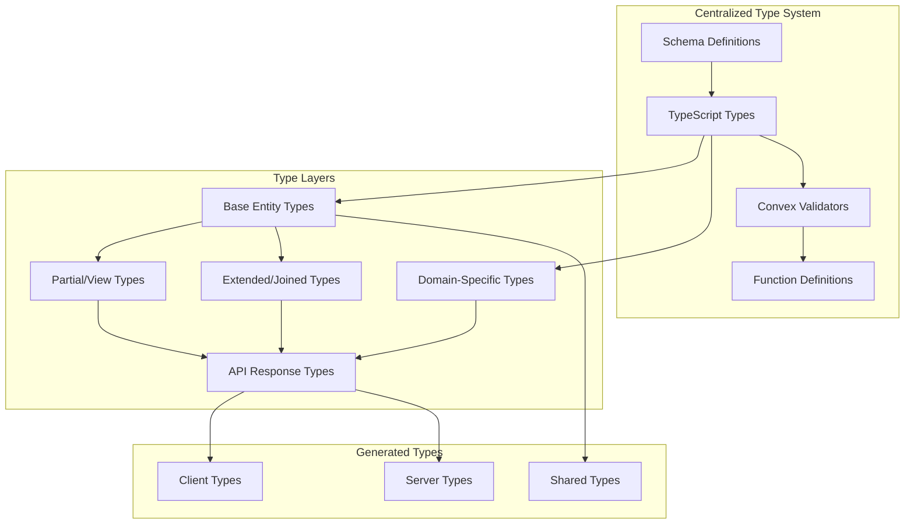

# Convex Type Consistency Design Document

## Overview

This design document outlines the technical approach for establishing a comprehensive, centralized type system across the LinkedUp Convex backend. After analyzing the complete codebase (24 modules, 100+ functions, 30+ collections), the goal is to eliminate massive type duplication, ensure consistency, and improve developer experience while maintaining full type safety.

## Architecture

### Current State Analysis

The current Convex backend has extensive type-related issues across its large codebase:

1. **Massive Inline Type Definitions**: 100+ functions each define return types inline using `v.object()` patterns
2. **Severe Type Duplication**: Core entities (User, Meeting, Transcript, etc.) are redefined 10-15 times each with variations
3. **Inconsistent Entity Shapes**: Same entities return different field combinations across modules
4. **Complex Schema Structure**: 11 schema modules with 30+ collections requiring consistent typing
5. **Maintenance Nightmare**: Schema changes require updates in 20+ locations
6. **Poor Developer Experience**: No autocomplete, type safety, or single source of truth
7. **Module Complexity**: Advanced features like OT operations, WebRTC signaling, vector embeddings, and real-time subscriptions all have custom type definitions

### Specific Type Duplication Examples Found

**User Entity** (redefined 8+ times):

- `convex/users/queries.ts`: 4 different User return types
- `convex/meetings/queries.ts`: 2 User summary types
- `convex/auth/guards.ts`: AuthIdentity type
- `convex/users/mutations.ts`: SaveOnboardingResult type

**Meeting Entity** (redefined 12+ times):

- `convex/meetings/queries.ts`: 6 different Meeting return types
- `convex/meetings/mutations.ts`: Meeting lifecycle types
- `convex/transcripts/queries.ts`: Meeting reference types
- `convex/insights/queries.ts`: Meeting summary types

**Complex Domain Types**:

- **Operational Transform**: `convex/notes/operations.ts` defines Operation, OperationWithMetadata
- **WebRTC Signaling**: `convex/schema/webrtc.ts` has complex session/signal types
- **Vector Embeddings**: `convex/schema/ai.ts` has embedding and vector index types
- **Matching System**: `convex/matching/` has compatibility scoring and queue types
- **Transcript Processing**: Time-bucketed, sharded transcript types with sequence management

### Target Architecture



## Design Principles

1. **Single Source of Truth**: All entity types defined in one centralized location
2. **Type-First + Validator Alignment**: Define TypeScript types as the single source of truth. Implement Convex validators in centralized modules and enforce alignment via type tests (no ad-hoc inline validators)
3. **Layered Types**: Base types, partial views, extended joins, domain-specific, and API responses
4. **Compile-Time Safety**: Full TypeScript checking with no runtime overhead
5. **Incremental Migration**: Safe, step-by-step refactoring without breaking changes
6. **Developer Experience**: Excellent autocomplete, error messages, and documentation
7. **Domain Modeling**: Proper types for complex domains (OT, WebRTC, Vector Search, etc.)
8. **Convex Compliance**: All functions use new function syntax with args and returns validators; index-first queries; clear public vs internal API boundaries

## Implementation Strategy

### Phase 1: Core Entity Type System

Create a comprehensive type system in `convex/types/` directory:

```
convex/types/
├── entities/           # Base entity types
│   ├── user.ts        # User, Profile, AuthIdentity
│   ├── meeting.ts     # Meeting, Participant, State
│   ├── transcript.ts  # Transcript, Segment, Session
│   ├── note.ts        # Note, Operation, OT types
│   ├── prompt.ts      # AI prompts and insights
│   ├── matching.ts    # Queue, Analytics, Scoring
│   ├── webrtc.ts      # Sessions, Signals, Metrics
│   ├── embedding.ts   # Vector embeddings and search
│   └── index.ts       # Main exports
├── validators/         # Convex validators derived from types
│   ├── user.ts
│   ├── meeting.ts
│   ├── transcript.ts
│   ├── note.ts
│   ├── prompt.ts
│   ├── matching.ts
│   ├── webrtc.ts
│   ├── embedding.ts
│   └── index.ts
├── api/               # API response types
│   ├── responses.ts
│   ├── pagination.ts
│   └── index.ts
├── domain/            # Domain-specific complex types
│   ├── operational-transform.ts
│   ├── vector-search.ts
│   ├── real-time.ts
│   └── index.ts
└── index.ts           # Main exports
```

### Phase 2: Comprehensive Entity Definitions

Based on the codebase analysis, here are the complete entity type definitions:

#### User Types

```typescript
// convex/types/entities/user.ts
import type { Id } from "../../_generated/dataModel";

export interface User {
  _id: Id<"users">;
  workosUserId: string;
  email: string;
  orgId?: string;
  orgRole?: string;
  displayName?: string;
  avatarUrl?: string;
  isActive: boolean;
  lastSeenAt?: number;
  onboardingComplete?: boolean;
  onboardingStartedAt?: number;
  onboardingCompletedAt?: number;
  createdAt: number;
  updatedAt: number;
}

export interface UserProfile {
  _id: Id<"profiles">;
  userId: Id<"users">;
  displayName: string;
  bio?: string;
  goals?: string;
  languages: string[];
  experience?: string;
  age?: number;
  gender?: "male" | "female" | "non-binary" | "prefer-not-to-say";
  field?: string;
  jobTitle?: string;
  company?: string;
  linkedinUrl?: string;
  createdAt: number;
  updatedAt: number;
}

export interface AuthIdentity {
  userId: Id<"users">;
  workosUserId: string;
  orgId: string | null;
  orgRole: string | null;
  email: string | null;
  name?: string | null;
}

// Derived types for different use cases
// Public-safe: No email by default for privacy unless explicitly needed
export type UserPublic = Pick<
  User,
  "_id" | "displayName" | "avatarUrl" | "isActive"
>;
// Public with email (opt-in, e.g., admin/internal UIs)
export type UserPublicWithEmail = UserPublic & Pick<User, "email">;
export type UserWithProfile = User & { profile?: UserProfile };
export type UserSummary = Pick<User, "_id" | "displayName" | "avatarUrl">;
export type UserWithOrgInfo = UserPublic & Pick<User, "orgId" | "orgRole">;
```

#### Meeting Types

```typescript
// convex/types/entities/meeting.ts
import type { Id } from "../../_generated/dataModel";
import type { UserSummary } from "./user";

export type MeetingLifecycleState =
  | "scheduled"
  | "active"
  | "concluded"
  | "cancelled";
export type ParticipantRole = "host" | "participant" | "observer";
export type ParticipantPresence = "invited" | "joined" | "left";

export interface Meeting {
  _id: Id<"meetings">;
  organizerId: Id<"users">;
  title: string;
  description?: string;
  scheduledAt?: number;
  duration?: number;
  webrtcEnabled?: boolean;
  streamRoomId?: string;
  state: MeetingLifecycleState;
  participantCount?: number;
  averageRating?: number;
  createdAt: number;
  updatedAt: number;
}

export interface MeetingParticipant {
  _id: Id<"meetingParticipants">;
  meetingId: Id<"meetings">;
  userId: Id<"users">;
  role: ParticipantRole;
  joinedAt?: number;
  leftAt?: number;
  presence: ParticipantPresence;
  createdAt: number;
}

export interface MeetingRuntimeState {
  _id: Id<"meetingState">;
  meetingId: Id<"meetings">;
  active: boolean;
  startedAt?: number;
  endedAt?: number;
  speakingStats?: {
    totalMs: number;
    byUserMs: Record<string, number>;
  };
  lullState?: {
    detected: boolean;
    lastActivity: number;
    duration: number;
  };
  topics: string[];
  recordingEnabled: boolean;
  updatedAt: number;
}

// Extended types for API responses
export interface MeetingWithUserRole extends Meeting {
  userRole: ParticipantRole;
  userPresence: ParticipantPresence;
  activeWebRTCSessions: number;
}

export interface MeetingParticipantWithUser extends MeetingParticipant {
  user: UserSummary;
  webrtcConnected: boolean;
  webrtcSessionCount: number;
}

export interface MeetingListItem
  extends Pick<
    Meeting,
    | "_id"
    | "organizerId"
    | "title"
    | "description"
    | "scheduledAt"
    | "duration"
    | "state"
    | "participantCount"
    | "createdAt"
    | "updatedAt"
  > {
  userRole: ParticipantRole;
  userPresence: ParticipantPresence;
}

export interface MeetingRuntimeStateWithMetrics extends MeetingRuntimeState {
  totalWebRTCSessions: number;
  connectedWebRTCSessions: number;
}
```

#### Transcript Types

```typescript
// convex/types/entities/transcript.ts
import type { Id } from "../../_generated/dataModel";

export interface Transcript {
  _id: Id<"transcripts">;
  meetingId: Id<"meetings">;
  bucketMs: number; // Time-bucketed for sharding
  sequence: number;
  speakerId?: string;
  text: string;
  confidence: number;
  startMs: number;
  endMs: number;
  isInterim?: boolean;
  wordCount: number;
  language?: string;
  createdAt: number;
}

export interface TranscriptSegment {
  _id: Id<"transcriptSegments">;
  meetingId: Id<"meetings">;
  startMs: number;
  endMs: number;
  speakers: string[];
  text: string;
  topics: string[];
  sentiment?: number;
  createdAt: number;
}

export interface TranscriptionSession {
  _id: Id<"transcriptionSessions">;
  meetingId: Id<"meetings">;
  provider: "whisper" | "assemblyai" | "getstream";
  status: "initializing" | "active" | "paused" | "completed" | "failed";
  startedAt: number;
  endedAt?: number;
  metadata?: Record<string, any>;
  createdAt: number;
  updatedAt: number;
}

// API response types
export type TranscriptChunk = Pick<
  Transcript,
  | "_id"
  | "sequence"
  | "speakerId"
  | "text"
  | "confidence"
  | "startMs"
  | "endMs"
  | "wordCount"
  | "language"
  | "createdAt"
>;

export interface TranscriptStats {
  totalChunks: number;
  totalWords: number;
  averageConfidence: number;
  duration: number;
  speakers: string[];
  languages: string[];
}
```

#### Operational Transform Types

```typescript
// convex/types/domain/operational-transform.ts
import type { Id } from "../../_generated/dataModel";

export type OperationType = "insert" | "delete" | "retain";

export interface Operation {
  type: OperationType;
  position: number;
  content?: string;
  length?: number;
}

export interface OperationWithMetadata extends Operation {
  id: string;
  authorId: Id<"users">;
  timestamp: number;
  sequence: number;
  transformedFrom?: string[];
}

export interface NoteOperation {
  _id: Id<"noteOps">;
  meetingId: Id<"meetings">;
  sequence: number;
  authorId: Id<"users">;
  operation: Operation;
  timestamp: number;
  applied: boolean;
}

export interface MeetingNote {
  _id: Id<"meetingNotes">;
  meetingId: Id<"meetings">;
  content: string;
  version: number;
  lastRebasedAt: number;
  updatedAt: number;
}

// API response types
export interface NoteOperationResult {
  success: boolean;
  serverSequence: number;
  transformedOperation: Operation;
  newVersion: number;
  conflicts: string[];
}
```

#### WebRTC Types

```typescript
// convex/types/entities/webrtc.ts
import type { Id } from "../../_generated/dataModel";

export type WebRTCSessionState =
  | "connecting"
  | "connected"
  | "disconnected"
  | "failed"
  | "closed";
export type WebRTCSignalType = "sdp" | "ice";
export type ConnectionQuality = "excellent" | "good" | "fair" | "poor";

export interface WebRTCSession {
  _id: Id<"webrtcSessions">;
  meetingId: Id<"meetings">;
  sessionId: string;
  userId: Id<"users">;
  state: WebRTCSessionState;
  metadata?: Record<string, any>;
  createdAt: number;
  updatedAt: number;
}

export interface WebRTCSignal {
  _id: Id<"webrtcSignals">;
  meetingId: Id<"meetings">;
  sessionId: string;
  fromUserId: Id<"users">;
  toUserId?: Id<"users">; // null for broadcast
  type: WebRTCSignalType;
  data: SDPData | ICEData;
  timestamp: number;
  processed: boolean;
}

export interface SDPData {
  type: "offer" | "answer" | "pranswer" | "rollback";
  sdp: string;
}

export interface ICEData {
  candidate: string;
  sdpMLineIndex?: number;
  sdpMid?: string;
  usernameFragment?: string;
}

export interface ConnectionMetrics {
  _id: Id<"connectionMetrics">;
  meetingId: Id<"meetings">;
  sessionId: string;
  userId: Id<"users">;
  quality: ConnectionQuality;
  stats: {
    bitrate: number;
    packetLoss: number;
    latency: number;
    jitter: number;
  };
  timestamp: number;
  createdAt: number;
}
```

#### Matching System Types

```typescript
// convex/types/entities/matching.ts
import type { Id } from "../../_generated/dataModel";

export type MatchingStatus = "waiting" | "matched" | "expired" | "cancelled";
export type MatchOutcome = "accepted" | "declined" | "completed";

export interface MatchingQueueEntry {
  _id: Id<"matchingQueue">;
  userId: Id<"users">;
  availableFrom: number;
  availableTo: number;
  constraints: {
    interests: string[];
    roles: string[];
    orgConstraints?: string;
  };
  status: MatchingStatus;
  matchedWith?: Id<"users">;
  createdAt: number;
  updatedAt: number;
}

export interface MatchingAnalytics {
  _id: Id<"matchingAnalytics">;
  userId: Id<"users">;
  matchId: string;
  outcome: MatchOutcome;
  feedback?: {
    rating: number;
    comments?: string;
  };
  features: Record<string, number>;
  weights: Record<string, number>;
  createdAt: number;
}

export interface CompatibilityFeatures {
  interestOverlap: number;
  experienceGap: number;
  industryMatch: number;
  timezoneCompatibility: number;
  vectorSimilarity?: number;
  orgConstraintMatch: number;
  languageOverlap: number;
  roleComplementarity: number;
}

export interface MatchResult {
  user1Id: Id<"users">;
  user2Id: Id<"users">;
  score: number;
  features: CompatibilityFeatures;
  explanation: string[];
  matchId: string;
}

// API response types
export interface QueueStatus extends MatchingQueueEntry {
  estimatedWaitTime?: number;
  queuePosition?: number;
}
```

#### Vector Embeddings Types

```typescript
// convex/types/entities/embedding.ts
import type { Id } from "../../_generated/dataModel";

export type EmbeddingSourceType =
  | "user"
  | "profile"
  | "meeting"
  | "note"
  | "transcriptSegment";
export type VectorIndexStatus = "active" | "inactive" | "migrating";

export interface Embedding {
  _id: Id<"embeddings">;
  sourceType: EmbeddingSourceType;
  sourceId: string;
  // Use ArrayBuffer (v.bytes) with Float32Array for performance & size
  vector: ArrayBuffer;
  model: string;
  dimensions: number;
  version: string;
  metadata: Record<string, any>;
  createdAt: number;
}

export interface VectorIndexMeta {
  _id: Id<"vectorIndexMeta">;
  provider: string;
  indexName: string;
  config: Record<string, any>;
  status: VectorIndexStatus;
  createdAt: number;
  updatedAt: number;
}

// API response types
export interface SimilaritySearchResult {
  embedding: Embedding;
  score: number;
  sourceData?: any;
}
```

### Phase 3: Validator Generation System

Create a comprehensive validator generation system:

```typescript
// Pattern: type-first + validators + type tests (no custom ConvexValidator<T> magic)
// convex/types/validators/user.ts
import { v } from "convex/values";
import type {
  User,
  UserProfile,
  UserPublic,
  UserPublicWithEmail,
  UserSummary,
} from "../entities/user";

export const UserV = {
  full: v.object({
    _id: v.id("users"),
    workosUserId: v.string(),
    email: v.string(),
    orgId: v.optional(v.string()),
    orgRole: v.optional(v.string()),
    displayName: v.optional(v.string()),
    avatarUrl: v.optional(v.string()),
    isActive: v.boolean(),
    lastSeenAt: v.optional(v.number()),
    onboardingComplete: v.optional(v.boolean()),
    onboardingStartedAt: v.optional(v.number()),
    onboardingCompletedAt: v.optional(v.number()),
    createdAt: v.number(),
    updatedAt: v.number(),
  }),

  public: v.object({
    _id: v.id("users"),
    displayName: v.optional(v.string()),
    avatarUrl: v.optional(v.string()),
    isActive: v.boolean(),
  }),

  publicWithEmail: v.object({
    _id: v.id("users"),
    displayName: v.optional(v.string()),
    email: v.string(),
    avatarUrl: v.optional(v.string()),
    isActive: v.boolean(),
  }),

  summary: v.object({
    _id: v.id("users"),
    displayName: v.optional(v.string()),
    avatarUrl: v.optional(v.string()),
  }),

  profile: v.object({
    _id: v.id("profiles"),
    userId: v.id("users"),
    displayName: v.string(),
    bio: v.optional(v.string()),
    goals: v.optional(v.string()),
    languages: v.array(v.string()),
    experience: v.optional(v.string()),
    age: v.optional(v.number()),
    gender: v.optional(
      v.union(
        v.literal("male"),
        v.literal("female"),
        v.literal("non-binary"),
        v.literal("prefer-not-to-say"),
      ),
    ),
    field: v.optional(v.string()),
    jobTitle: v.optional(v.string()),
    company: v.optional(v.string()),
    linkedinUrl: v.optional(v.string()),
    createdAt: v.number(),
    updatedAt: v.number(),
  }),
} as const;

// In tests (tsd or vitest's expectTypeOf), assert equivalence between TS types and Infer<typeof validator>
// This enforces type-first alignment without runtime overhead.
```

### Phase 4: Function Refactoring Strategy

Systematically refactor all 100+ functions to use centralized types:

```typescript
// Before (inline types) - convex/users/queries.ts
export const getUserById = query({
  args: { userId: v.id("users") },
  returns: v.union(
    v.object({
      _id: v.id("users"),
      workosUserId: v.string(),
      email: v.string(),
      // ... 15 more fields repeated
    }),
    v.null(),
  ),
  handler: async (ctx, { userId }) => {
    return await ctx.db.get(userId);
  },
});

// After (centralized types)
import { UserV } from "../types/validators/user";
import type { User } from "../types/entities/user";

export const getUserById = query({
  args: { userId: v.id("users") },
  returns: v.union(UserV.full, v.null()),
  handler: async (ctx, { userId }): Promise<User | null> => {
    return await ctx.db.get(userId);
  },
});
```

## Migration Strategy

### Phase 1: Foundation (Week 1)

1. Create centralized type definitions for all 30+ entities
2. Generate corresponding Convex validators for all types
3. Set up comprehensive type validation utilities
4. Create extensive tests for type consistency across all modules

### Phase 2: Core Modules (Week 2)

1. Refactor user-related queries and mutations (8 functions)
2. Update meeting lifecycle functions (15 functions)
3. Migrate authentication and authorization functions (5 functions)
4. Validate no breaking changes in API responses

### Phase 3: Complex Domains (Week 3)

1. Refactor transcript and notes functions (20 functions)
2. Update real-time subscription types (10 functions)
3. Migrate matching system functions (12 functions)
4. Ensure WebSocket type consistency

### Phase 4: Advanced Features (Week 4)

1. Refactor AI and insights functions (8 functions)
2. Update embeddings and vector search types (6 functions)
3. Migrate analytics and monitoring functions (10 functions)
4. Complete audit logging and feature flags (5 functions)

### Phase 5: WebRTC and Real-time (Week 5)

1. Refactor WebRTC signaling functions (8 functions)
2. Update operational transform types (6 functions)
3. Migrate real-time subscription management (5 functions)
4. Complete performance monitoring types (4 functions)

### Phase 6: Validation and Cleanup (Week 6)

1. Comprehensive testing of all 100+ refactored functions
2. Performance validation across all modules
3. Documentation updates for all type definitions
4. Remove deprecated inline type definitions

## Type Safety Guarantees

### Compile-Time Checks

- All 100+ function arguments and return types validated by TypeScript
- Convex validators must satisfy corresponding TypeScript types
- No runtime type coercion or unsafe casting
- Full IDE support with autocomplete and error detection across all modules

### Runtime Validation

- Convex validators ensure data shape consistency across all collections
- Input validation prevents malformed data in all 30+ collections
- Return type validation catches implementation errors
- Comprehensive error messages for type mismatches

### Testing Strategy

- Unit tests for all type validators across all modules
- Integration tests for function type consistency
- Property-based testing for complex domain type invariants (OT, WebRTC, Vector Search)
- Performance tests to ensure no overhead across large codebase

## Performance Considerations

### Compile-Time Impact

- Type checking adds minimal build time overhead even with 100+ functions
- Generated validators are optimized for performance
- No runtime type information in production builds
- Tree-shaking eliminates unused type definitions

### Runtime Performance

- Convex validators have minimal overhead across all functions
- No additional serialization/deserialization cost; embeddings should use v.bytes (ArrayBuffer) not number[] for performance & cost
- Type definitions are compile-time only
- No impact on function execution speed

### Bundle Size

- TypeScript types are stripped in production
- Validators are optimized by Convex compiler
- No additional client-side type overhead
- Shared types reduce duplication across modules

## Monitoring and Validation

### Type Consistency Checks

- Automated tests validate validator-type alignment across all modules
- CI/CD pipeline enforces type safety for all 100+ functions
- Regular audits for type drift detection
- Metrics on type error frequency

### Developer Experience Metrics

- IDE autocomplete accuracy across all modules
- Type error resolution time
- Developer onboarding efficiency with complex domains
- Code review type-related feedback reduction

### Performance Monitoring

- Function execution time impact across all modules
- Build time overhead tracking
- Bundle size impact measurement
- Memory usage validation

## Future Enhancements

### Code Generation

- Automatic validator generation from TypeScript types
- Client SDK generation with full type safety
- API documentation generation from types
- Mock data generation for testing complex domains
  - Generator should prefer ArrayBuffer (v.bytes) for numeric vectors and provide helpers to/from Float32Array

### Advanced Type Features

- Branded types for enhanced type safety (IDs, timestamps)
- Conditional types for complex scenarios (OT operations, WebRTC states)
- Template literal types for string validation
- Utility types for common patterns across modules

### Integration Improvements

- GraphQL schema generation from types
- OpenAPI specification generation
- Database migration type validation
- Real-time type checking in development for complex domains

## Additional Standards

- PaginationResult: a shared validator and TS type for paginated responses to ensure consistent shape:
  - page: T[]
  - isDone: boolean
  - continueCursor: string | null
- Result<T, E>: standardized API response envelope for public endpoints (optional for internal), with success flag and optional error.
- Index-first queries: All list/lookup queries specify a withIndex per convex_rules.mdc; do not use q.filter.
- Public vs internal types: Public shapes must not include sensitive fields by default (e.g., email); internal/admin endpoints may use UserPublicWithEmail where needed.

Finally, here is an example:
```typescript
// Example of a fully compliant Convex function following all guidelines
import { query } from "../_generated/server";
import { v } from "convex/values";
import { paginationOptsValidator } from "convex/server";
import { PaginationResultV } from "../types/api/responses";
import { UserV } from "../types/validators/user";
import type { UserSummary } from "../types/entities/user";

// ✅ Uses new function syntax with args and returns validators
// ✅ Index-first query pattern (no q.filter)
// ✅ Proper pagination with standardized return shape
// ✅ Centralized types and validators
export const listActiveUsers = query({
  args: {
    paginationOpts: paginationOptsValidator,
    activeOnly: v.boolean(),
  },
  returns: PaginationResultV(UserV.summary),
  handler: async (
    ctx,
    { paginationOpts, activeOnly },
  ): Promise<{
    page: UserSummary[];
    isDone: boolean;
    continueCursor: string | null;
  }> => {
    // ✅ Index-first query - assumes "by_isActive" index exists in schema
    const q = ctx.db
      .query("users")
      .withIndex("by_isActive", (q) => q.eq("isActive", activeOnly))
      .order("desc");

    // ✅ Proper pagination usage
    const page = await q.paginate(paginationOpts);

    return page;
  },
});

// ✅ Internal function example - not exposed to client
export const getUserByIdInternal = query({
  args: { userId: v.id("users") },
  returns: v.union(UserV.full, v.null()),
  handler: async (ctx, { userId }) => {
    return await ctx.db.get(userId);
  },
});

// ✅ Public function that doesn't expose sensitive data by default
export const getPublicUserProfile = query({
  args: { userId: v.id("users") },
  returns: v.union(UserV.public, v.null()),
  handler: async (ctx, { userId }) => {
    const user = await ctx.db.get(userId);
    if (!user) return null;

    // ✅ Return only public-safe fields
    return {
      _id: user._id,
      displayName: user.displayName,
      avatarUrl: user.avatarUrl,
      isActive: user.isActive,
    };
  },
});
```
