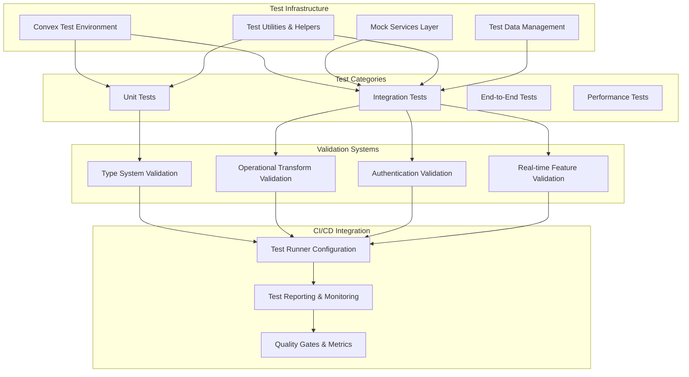

# Test Infrastructure Fixes Design Document

## Overview

This design document outlines the technical approach for fixing the comprehensive testing infrastructure issues in the LinkedUp project. The current test suite has 77 failed tests out of 216 total tests, with failures spanning multiple categories: convex-test library compatibility, operational transform logic errors, test infrastructure problems, and type system validation issues.

The goal is to achieve a robust, reliable test suite with 95%+ pass rate that properly validates all backend functionality, real-time features, and type safety.

## Architecture

### Current State Analysis

The test failures fall into several distinct categories:

1. **convex-test Library Issues (60+ tests affected)**:
   - `(intermediate value).glob is not a function` error across multiple test files
   - Indicates version compatibility or configuration issues with convex-test
   - Affects auth, permissions, matching, insights, transcripts, and integration tests

2. **Operational Transform Logic Errors (5 tests affected)**:
   - Position calculation errors in concurrent insert scenarios
   - Overlapping delete operations not properly handled
   - Diff creation logic producing incorrect positions
     t consistency issues with multiple concurrent operations

3. **Type System Validation Issues**:
   - Type drift detected in Transcript entity (missing `_creationTime`)
   - 5 validators failing validation
   - Health monitoring reporting system as unhealthy

4. **Test Infrastructure Problems**:
   - Inconsistent test initialization patterns
   - Missing proper mocking for external services
   - Test isolation issues

### Target Architecture



## Implementation Strategy

### Phase 1: Fix convex-test Library Compatibility

**Root Cause Analysis:**
The `(intermediate value).glob is not a function` error suggests either:

1. Version incompatibility between convex-test and current Convex version
2. Incorrect import/usage patterns
3. Missing dependencies or configuration issues

**Solution Approach:**

1. **Update convex-test Library**:

   ```bash
   # Check current versions
   bun list | grep convex

   # Update to latest compatible version
   bun update convex-test
   bun update convex
   ```

2. **Fix Import Patterns**:

   ```typescript
   // Current problematic pattern (from error analysis)
   import { convexTest } from "convex-test";

   // Correct pattern (based on latest convex-test docs)
   import { convexTest } from "convex-test";
   import schema from "../schema";

   // Proper initialization
   const t = convexTest(schema);
   ```

3. **Configuration Updates**:

   ```typescript
   // vitest.config.ts updates
   import { defineConfig } from "vitest/config";

   export default defineConfig({
     test: {
       environment: "node",
       globals: true,
       setupFiles: ["./convex/test/setup.ts"],
     },
   });
   ```

4. **Test Setup File**:

   ```typescript
   // convex/test/setup.ts
   import { beforeEach, afterEach } from "vitest";

   beforeEach(() => {
     // Global test setup
   });

   afterEach(() => {
     // Global test cleanup
   });
   ```

### Phase 2: Fix Operational Transform Logic

**Root Cause Analysis:**
The OT failures indicate fundamental issues with position calculation logic:

1. **Concurrent Inserts at Same Position**: Test expects position 4, gets position 3
2. **Overlapping Deletes**: Test expects length 3, gets length 2
3. **Diff Creation**: Position calculations off by 1

**Solution Approach:**

1. **Fix Insert vs Insert Transformation**:

   ```typescript
   // Current (incorrect) logic
   function transformInsertVsInsert(opA: Operation, opB: Operation): Operation {
     if (opA.position <= opB.position) {
       return { ...opB, position: opB.position + opA.content!.length };
     }
     return opB;
   }

   // Corrected logic
   function transformInsertVsInsert(opA: Operation, opB: Operation): Operation {
     // When inserts are at the same position, the second operation should be shifted
     if (opA.position <= opB.position) {
       return { ...opB, position: opB.position + (opA.content?.length || 0) };
     }
     return opB;
   }
   ```

2. **Fix Delete vs Delete Transformation**:

   ```typescript
   // Current (incorrect) logic - not handling overlap properly
   function transformDeleteVsDelete(opA: Operation, opB: Operation): Operation {
     const aEnd = opA.position + opA.length!;
     const bEnd = opB.position + opB.length!;

     // Handle overlapping deletes
     if (opA.position < bEnd && aEnd > opB.position) {
       // Calculate overlap
       const overlapStart = Math.max(opA.position, opB.position);
       const overlapEnd = Math.min(aEnd, bEnd);
       const overlapLength = overlapEnd - overlapStart;

       // Adjust B's length to account for overlap
       return {
         ...opB,
         position: Math.min(opA.position, opB.position),
         length: opB.length! - overlapLength,
       };
     }

     return opB;
   }
   ```

3. **Fix Diff Creation Logic**:

   ```typescript
   // Current (incorrect) - off-by-one errors
   function createDiff(oldDoc: string, newDoc: string): Operation[] {
     // Use proper string comparison algorithm
     const operations: Operation[] = [];
     let oldIndex = 0;
     let newIndex = 0;

     while (oldIndex < oldDoc.length || newIndex < newDoc.length) {
       if (oldIndex >= oldDoc.length) {
         // Insert remaining new characters
         operations.push({
           type: "insert",
           position: oldIndex,
           content: newDoc.slice(newIndex),
         });
         break;
       } else if (newIndex >= newDoc.length) {
         // Delete remaining old characters
         operations.push({
           type: "delete",
           position: oldIndex,
           length: oldDoc.length - oldIndex,
         });
         break;
       } else if (oldDoc[oldIndex] === newDoc[newIndex]) {
         // Characters match, advance both
         oldIndex++;
         newIndex++;
       } else {
         // Find the type of difference
         // Implementation of proper diff algorithm
         // ...
       }
     }

     return operations;
   }
   ```

### Phase 3: Fix Type System Validation Issues

**Root Cause Analysis:**
Type validation is detecting drift in the Transcript entity and validator failures.

**Solution Approach:**

1. **Fix Transcript Entity Type Drift**:

   ```typescript
   // convex/types/entities/transcript.ts
   export interface Transcript {
     _id: Id<"transcripts">;
     _creationTime: number; // Add missing system field
     meetingId: Id<"meetings">;
     bucketMs: number;
     sequence: number;
     speakerId?: string;
     text: string;
     confidence: number;
     startMs: number;
     endMs: number;
     wordCount: number;
     language?: string;
     createdAt: number;
   }
   ```

2. **Update Corresponding Validators**:

   ```typescript
   // convex/types/validators/transcript.ts
   export const TranscriptV = {
     full: v.object({
       _id: v.id("transcripts"),
       _creationTime: v.number(), // Add missing validator
       meetingId: v.id("meetings"),
       bucketMs: v.number(),
       sequence: v.number(),
       speakerId: v.optional(v.string()),
       text: v.string(),
       confidence: v.number(),
       startMs: v.number(),
       endMs: v.number(),
       wordCount: v.number(),
       language: v.optional(v.string()),
       createdAt: v.number(),
     }),
   };
   ```

3. **Fix Validator Consistency Issues**:

   ```typescript
   // Add comprehensive type tests
   // convex/types/__tests__/type-alignment.test.ts
   import { expectTypeOf } from "vitest";
   import type { Infer } from "convex/values";
   import type { Transcript } from "../entities/transcript";
   import { TranscriptV } from "../validators/transcript";

   test("Transcript type alignment", () => {
     expectTypeOf<Infer<typeof TranscriptV.full>>().toEqualTypeOf<Transcript>();
   });
   ```

### Phase 4: Improve Test Infrastructure

**Solution Approach:**

1. **Standardize Test Initialization**:

   ```typescript
   // convex/test/helpers.ts
   import { convexTest } from "convex-test";
   import schema from "../schema";

   export function createTestEnvironment() {
     return convexTest(schema);
   }

   export async function createTestUser(t: any, userData: any) {
     return await t.run(async (ctx: any) => {
       return await ctx.db.insert("users", {
         workosUserId: userData.workosUserId || "test-user-id",
         email: userData.email || "test@example.com",
         isActive: true,
         createdAt: Date.now(),
         updatedAt: Date.now(),
         ...userData,
       });
     });
   }

   export async function createTestMeeting(
     t: any,
     organizerId: any,
     meetingData: any = {},
   ) {
     return await t.run(async (ctx: any) => {
       return await ctx.db.insert("meetings", {
         organizerId,
         title: meetingData.title || "Test Meeting",
         state: "scheduled",
         createdAt: Date.now(),
         updatedAt: Date.now(),
         ...meetingData,
       });
     });
   }
   ```

2. **Mock External Services**:

   ```typescript
   // convex/test/mocks.ts
   export const mockWorkOSAuth = {
     getUserIdentity: () => ({
       subject: "test-user-id",
       email: "test@example.com",
       org_id: "test-org",
       org_role: "member",
     }),
   };

   export const mockGetStreamAPI = {
     createRoom: vi.fn().mockResolvedValue({ roomId: "test-room-id" }),
     generateToken: vi.fn().mockResolvedValue("test-token"),
     startRecording: vi
       .fn()
       .mockResolvedValue({ recordingId: "test-recording" }),
   };

   export const mockWebRTCProvider = {
     createRoom: vi.fn().mockResolvedValue({
       roomId: "webrtc-room-id",
       iceServers: [{ urls: "stun:stun.l.google.com:19302" }],
     }),
     generateSessionId: vi.fn().mockResolvedValue("webrtc-session-id"),
   };

   export const mockNextJSAPI = {
     fetch: vi.fn().mockResolvedValue({
       ok: true,
       json: () => Promise.resolve({ success: true }),
     }),
   };

   export const mockAIProvider = {
     generateEmbedding: vi.fn().mockResolvedValue([0.1, 0.2, 0.3]),
     generateInsights: vi.fn().mockResolvedValue({
       summary: "Test summary",
       actionItems: ["Test action"],
     }),
   };
   ```

3. **Update Test Patterns**:

   ```typescript
   // Example updated test file
   import { describe, test, expect, beforeEach } from "vitest";
   import { createTestEnvironment, createTestUser } from "../test/helpers";

   describe("User Management", () => {
     let t: any;

     beforeEach(() => {
       t = createTestEnvironment();
     });

     test("should create user successfully", async () => {
       const userId = await createTestUser(t, {
         email: "test@example.com",
         displayName: "Test User",
       });

       const user = await t.run(async (ctx: any) => {
         return await ctx.db.get(userId);
       });

       expect(user).toBeDefined();
       expect(user.email).toBe("test@example.com");
     });
   });
   ```

### Phase 5: Performance and Monitoring Improvements

**Solution Approach:**

1. **Test Performance Optimization**:

   ```typescript
   // vitest.config.ts
   export default defineConfig({
     test: {
       environment: "node",
       globals: true,
       setupFiles: ["./convex/test/setup.ts"],
       testTimeout: 10000, // 10 second timeout
       hookTimeout: 5000, // 5 second hook timeout
       pool: "threads",
       poolOptions: {
         threads: {
           singleThread: true, // Avoid race conditions in Convex tests
         },
       },
     },
   });
   ```

2. **Test Monitoring and Reporting**:

   ```typescript
   // convex/test/monitoring.ts
   export class TestMonitor {
     private static instance: TestMonitor;
     private testResults: Map<string, TestResult> = new Map();

     static getInstance(): TestMonitor {
       if (!TestMonitor.instance) {
         TestMonitor.instance = new TestMonitor();
       }
       return TestMonitor.instance;
     }

     recordTest(testName: string, duration: number, status: "pass" | "fail") {
       this.testResults.set(testName, {
         duration,
         status,
         timestamp: Date.now(),
       });
     }

     generateReport(): TestReport {
       const results = Array.from(this.testResults.values());
       return {
         totalTests: results.length,
         passedTests: results.filter((r) => r.status === "pass").length,
         failedTests: results.filter((r) => r.status === "fail").length,
         averageDuration:
           results.reduce((sum, r) => sum + r.duration, 0) / results.length,
         slowTests: results.filter((r) => r.duration > 1000).map((r) => r),
       };
     }
   }
   ```

## Migration Strategy

### Phase 1: Emergency Fixes (Week 1)

1. **Day 1-2**: Fix convex-test library compatibility issues
   - Update dependencies
   - Fix import patterns
   - Update test configuration
   - Validate basic test initialization works

2. **Day 3-4**: Fix operational transform logic errors
   - Correct position calculation algorithms
   - Fix overlapping operation handling
   - Update diff creation logic
   - Validate all OT tests pass

3. **Day 5**: Fix type system validation issues
   - Add missing system fields to types
   - Update validators for consistency
   - Fix type drift detection
   - Ensure type system health

### Phase 2: Infrastructure Improvements (Week 2)

1. **Day 1-3**: Standardize test infrastructure
   - Create test helpers and utilities
   - Implement proper mocking
   - Update all test files to use standard patterns
   - Ensure test isolation

2. **Day 4-5**: Performance and monitoring
   - Optimize test execution speed
   - Add test monitoring and reporting
   - Implement quality gates
   - Validate CI/CD integration

### Phase 3: Validation and Documentation (Week 3)

1. **Day 1-2**: Comprehensive validation
   - Run full test suite multiple times
   - Validate 95%+ pass rate
   - Test in different environments
   - Performance benchmarking

2. **Day 3-5**: Documentation and maintenance
   - Document test patterns and best practices
   - Create troubleshooting guides
   - Set up monitoring and alerting
   - Train team on new test infrastructure

## Quality Assurance

### Test Coverage Targets

- **Unit Tests**: 90%+ code coverage
- **Integration Tests**: All critical user flows covered
- **Performance Tests**: All SLO targets validated
- **Type Tests**: 100% type-validator alignment

### Performance Targets

- **Full Test Suite**: < 30 seconds execution time
- **Individual Tests**: < 1 second average execution time
- **Test Reliability**: 95%+ pass rate consistency
- **CI/CD Integration**: < 2 minutes total pipeline time for tests

### Monitoring and Alerting

- **Test Failure Rate**: Alert if > 5% of tests fail
- **Test Performance**: Alert if test suite takes > 45 seconds
- **Type Drift**: Alert on any type inconsistencies
- **Dependency Issues**: Alert on library compatibility problems

## Risk Mitigation

### High-Risk Areas

1. **convex-test Library Updates**: May introduce new compatibility issues
   - Mitigation: Thorough testing in staging environment
   - Rollback plan: Pin to known working version

2. **Operational Transform Logic Changes**: May break existing collaborative editing
   - Mitigation: Comprehensive test coverage of all OT scenarios
   - Validation: Manual testing of collaborative editing features

3. **Type System Changes**: May break existing code
   - Mitigation: Gradual rollout with type checking at each step
   - Validation: Full TypeScript compilation validation

### Rollback Strategy

- **Immediate Rollback**: Revert to previous working test configuration
- **Partial Rollback**: Disable problematic tests while fixing issues
- **Progressive Rollback**: Fix issues incrementally while maintaining test coverage

## Success Metrics

### Primary Metrics

- **Test Pass Rate**: Target 95%+ (currently ~64%)
- **Test Execution Time**: Target < 30 seconds (current unknown)
- **Test Reliability**: Target 99%+ consistency across runs
- **Developer Experience**: Target < 5 minutes from code change to test feedback

### Secondary Metrics

- **Type Safety**: 100% type-validator alignment
- **Code Coverage**: 90%+ for critical paths
- **CI/CD Integration**: 100% test automation
- **Documentation Coverage**: All test patterns documented

This comprehensive design addresses all identified testing issues and provides a robust foundation for reliable, fast, and maintainable tests that will support the LinkedUp project's continued development and quality assurance.
