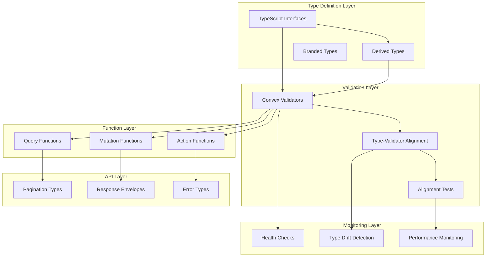

# Convex Type System Architecture

## Overview

This document describes the architecture and design principles of the centralized Convex type system. The system provides a comprehensive, type-safe foundation for all Convex functions while maintaining excellent performance and developer experience.

## Design Principles

### 1. Single Source of Truth

All entity types are defined in one centralized location, eliminating duplication and ensuring consistency across the entire codebase.

```
convex/types/entities/
├── user.ts        # User, UserProfile, AuthIdentity
├── meeting.ts     # Meeting, Participant, State
├── transcript.ts  # Transcript, Segment, Session
├── webrtc.ts      # Sessions, Signals, Metrics
├── embedding.ts   # Vector embeddings and search
└── index.ts       # Barrel exports
```

### 2. Type-First Development

TypeScript types are defined first as the authoritative source, with Convex validators derived from and aligned with these types.

```typescript
// 1. Define TypeScript interface first
interface  {
  _id: Id<"users">;
  email: string;
  displayName?: string;
  // ...
}

// 2. Create aligned Convex validator
export const UserV = {
  full: v.object({
    _id: v.id("users"),
    email: v.string(),
    displayName: v.optional(v.string()),
    // ...
  }),
} as const;

// 3. Validate alignment in tests
type UserValidatorType = Infer<typeof UserV.full>;
type TypesMatch = AssertEqual<User, UserValidatorType>; // Must be true
```

### 3. Layered Type Architecture

The system uses a layered approach to provide different views of the same data:

```typescript
// Base entity type
interface User {
  /* full definition */
}

// Derived types for different use cases
type UserPublic = Pick<User, "_id" | "displayName" | "avatarUrl" | "isActive">;
type UserSummary = Pick<User, "_id" | "displayName" | "avatarUrl">;
type UserWithProfile = User & { profile?: UserProfile };
```

### 4. Compile-Time Safety

Full TypeScript checking with no runtime overhead, ensuring type safety without performance impact.

### 5. Convex Compliance

All functions follow Convex best practices:

- New function syntax with args and returns validators
- Index-first query patterns
- Proper separation of public vs internal functions
- ArrayBuffer usage for vector data

## System Architecture

### Directory Structure

```
convex/types/
├── entities/           # Core entity type definitions
│   ├── user.ts
│   ├── meeting.ts
│   ├── transcript.ts
│   ├── webrtc.ts
│   ├── embedding.ts
│   ├── matching.ts
│   └── index.ts
├── validators/         # Convex validators aligned with types
│   ├── user.ts
│   ├── meeting.ts
│   ├── transcript.ts
│   ├── webrtc.ts
│   ├── embedding.ts
│   ├── matching.ts
│   ├── common.ts
│   └── index.ts
├── api/               # API response and pagination types
│   ├── responses.ts
│   ├── pagination.ts
│   └── index.ts
├── domain/            # Domain-specific complex types
│   ├── operational-transform.ts
│   ├── vector-search.ts
│   └── index.ts
├── __tests__/         # Comprehensive test suite
│   ├── function-type-consistency.test.ts
│   ├── property-based-tests.test.ts
│   ├── validator-consistency.test.ts
│   ├── type-alignment.test.ts
│   ├── performance-validation.test.ts
│   ├── monitoring-tools.test.ts
│   └── type-validation-utils.ts
├── utils.ts           # Type utilities and helpers
├── monitoring.ts      # Health monitoring and validation tools
├── index.ts           # Main barrel export
├── MIGRATION_GUIDE.md
├── PERFORMANCE_GUIDE.md
├── API_REFERENCE.md
└── ARCHITECTURE.md
```

### Type Flow Architecture



## Core Components

### Entity Types

Entity types represent the core data structures in the system:

```typescript
// Base entity with system fields
interface BaseEntity {
  _id: Id<string>;
  createdAt: number;
  updatedAt: number;
}

// Domain entity extending base
interface User extends BaseEntity {
  _id: Id<"users">;
  workosUserId: string;
  email: string;
  displayName?: string;
  // ... other fields
}
```

### Validator Collections

Validators are organized into collections that mirror the entity structure:

```typescript
export const UserV = {
  // Complete entity validator
  full: v.object({
    _id: v.id("users"),
    workosUserId: v.string(),
    email: v.string(),
    // ... all fields
  }),

  // Public-safe variant
  public: v.object({
    _id: v.id("users"),
    displayName: v.optional(v.string()),
    avatarUrl: v.optional(v.string()),
    isActive: v.boolean(),
  }),

  // Summary for lists
  summary: v.object({
    _id: v.id("users"),
    displayName: v.optional(v.string()),
    avatarUrl: v.optional(v.string()),
  }),
} as const;
```

### API Response Types

Standardized response patterns for consistency:

```typescript
// Pagination wrapper
interface PaginationResult<T> {
  page: T[];
  isDone: boolean;
  continueCursor: string | null;
}

// Result envelope for error handling
interface Result<T, E = string> {
  success: boolean;
  data?: T;
  error?: E;
}

// Validators for response types
export const PaginationResultV = <T>(itemValidator: T) =>
  v.object({
    page: v.array(itemValidator),
    isDone: v.boolean(),
    continueCursor: v.union(v.string(), v.null()),
  });

export const ResultV = <T>(dataValidator: T) =>
  v.union(
    v.object({
      success: v.literal(true),
      data: dataValidator,
    }),
    v.object({
      success: v.literal(false),
      error: v.string(),
    }),
  );
```

### Domain-Specific Types

Complex domain types for specialized functionality:

```typescript
// Operational Transform types
interface Operation {
  type: "insert" | "delete" | "retain";
  position: number;
  content?: string;
  length?: number;
}

// WebRTC signaling types
interface WebRTCSignal {
  sessionId: string;
  type: "sdp" | "ice";
  data: SDPData | ICEData;
  timestamp: number;
}

// Vector embedding types (optimized for performance)
interface Embedding {
  vector: ArrayBuffer; // Use ArrayBuffer for performance
  dimensions: number;
  model: string;
  // ...
}
```

## Performance Architecture

### Compile-Time Optimization

The system is designed for optimal compile-time performance:

1. **Minimal Type Complexity**: Types are structured to minimize TypeScript compilation overhead
2. **Efficient Imports**: Barrel exports reduce import complexity
3. **Type Caching**: TypeScript can effectively cache type information
4. **Incremental Compilation**: Changes to types don't require full recompilation

### Runtime Optimization

Zero runtime overhead through compile-time type erasure:

1. **Type Stripping**: All TypeScript types are removed in production builds
2. **Validator Optimization**: Convex optimizes validators automatically
3. **Tree Shaking**: Unused type definitions are eliminated
4. **ArrayBuffer Usage**: Vector data uses ArrayBuffer for optimal performance

### Memory Optimization

Efficient memory usage during development and testing:

1. **Bounded Validation**: Validator validation uses bounded memory
2. **Lazy Loading**: Types are loaded only when needed
3. **Garbage Collection**: No memory leaks in type validation
4. **Efficient Structures**: Type definitions use memory-efficient patterns

## Monitoring Architecture

### Health Monitoring System

Comprehensive monitoring of type system health:

```typescript
interface HealthReport {
  healthy: boolean;
  totalValidators: number;
  failedValidators: number;
  errors: string[];
  warnings: string[];
  performance: PerformanceMetrics;
  timestamp: number;
}

interface PerformanceMetrics {
  validatorCount: number;
  averageValidationTime: number;
  maxValidationTime: number;
  totalValidationTime: number;
  memoryUsage?: number;
}
```

### Type Drift Detection

Automated detection of schema changes that affect types:

```typescript
interface TypeDriftCheck {
  entityName: string;
  expectedFields: string[];
  actualFields: string[];
  missingFields: string[];
  extraFields: string[];
  hasDrift: boolean;
}
```

### Performance Monitoring

Continuous monitoring of type system performance:

1. **Validation Time Tracking**: Monitor validator validation performance
2. **Memory Usage Monitoring**: Track memory consumption during validation
3. **Compilation Time Tracking**: Monitor TypeScript compilation performance
4. **Regression Detection**: Automated detection of performance regressions

## Testing Architecture

### Multi-Layer Testing Strategy

Comprehensive testing at multiple levels:

1. **Unit Tests**: Individual validator and type validation
2. **Integration Tests**: Function type consistency across modules
3. **Property-Based Tests**: Complex domain type invariants
4. **Performance Tests**: Validation performance and scalability
5. **Type Alignment Tests**: TypeScript type and validator alignment

### Property-Based Testing

Advanced testing for complex domain types:

```typescript
interface PropertyTestCase<T> {
  name: string;
  generator: () => T;
  validator: (value: T) => boolean;
  invariant: string;
}

// Example: Vector similarity properties
const vectorSimilarityTest: PropertyTestCase<[Embedding, Embedding]> = {
  name: "Vector similarity computation properties",
  generator: () => [generateEmbedding(), generateEmbedding()],
  validator: ([emb1, emb2]) => {
    const similarity = computeCosineSimilarity(emb1.vector, emb2.vector);
    return similarity >= -1.01 && similarity <= 1.01;
  },
  invariant: "Cosine similarity in [-1,1], self-similarity ≈ 1",
};
```

### Automated Validation

CI/CD integration for continuous validation:

1. **Type Consistency Checks**: Ensure all functions use proper validators
2. **Performance Regression Tests**: Detect performance degradation
3. **Type Drift Detection**: Monitor schema changes
4. **Validator Alignment**: Verify TypeScript types match validators

## Migration Architecture

### Incremental Migration Strategy

Safe, step-by-step migration from inline types to centralized types:

1. **Phase 1**: Create centralized type definitions
2. **Phase 2**: Migrate core entity functions
3. **Phase 3**: Migrate complex domain functions
4. **Phase 4**: Migrate API response functions
5. **Phase 5**: Cleanup and validation

### Backward Compatibility

Maintain compatibility during migration:

1. **Gradual Replacement**: Replace inline types incrementally
2. **Validation at Each Step**: Ensure no breaking changes
3. **Runtime Behavior Preservation**: Maintain identical runtime behavior
4. **Client Compatibility**: Ensure client code continues to work

## Security Architecture

### Type Safety as Security

Type safety provides security benefits:

1. **Input Validation**: Convex validators prevent malformed data
2. **Output Validation**: Return type validation prevents data leaks
3. **Public vs Internal Types**: Clear separation of public and internal data
4. **Sensitive Data Protection**: Public types exclude sensitive fields by default

### Privacy by Design

Built-in privacy protection:

```typescript
// Public type excludes email by default
type UserPublic = Pick<User, "_id" | "displayName" | "avatarUrl" | "isActive">;

// Email included only when explicitly needed
type UserPublicWithEmail = UserPublic & Pick<User, "email">;
```

## Scalability Architecture

### Horizontal Scalability

The system scales with codebase growth:

1. **Modular Design**: Types are organized by domain
2. **Independent Validation**: Validators can be validated independently
3. **Parallel Processing**: Type checking can be parallelized
4. **Incremental Updates**: Only changed types need revalidation

### Performance Scalability

Performance scales linearly with system size:

1. **O(n) Validation**: Validator validation scales linearly
2. **Efficient Caching**: TypeScript caches type information effectively
3. **Minimal Overhead**: Each additional type adds minimal overhead
4. **Optimized Structures**: Type definitions use efficient patterns

## Future Architecture

### Planned Enhancements

1. **Code Generation**: Automatic validator generation from TypeScript types
2. **Real-time Monitoring**: Live performance monitoring in development
3. **Advanced Optimization**: AI-powered type structure optimization
4. **Visual Tools**: Type relationship visualization and exploration

### Extension Points

The architecture supports future extensions:

1. **Plugin System**: Support for custom type validators
2. **External Integrations**: Integration with external schema systems
3. **Advanced Analytics**: Detailed type usage analytics
4. **Custom Monitoring**: Extensible monitoring and alerting system

## Conclusion

The centralized Convex type system architecture provides a robust, scalable, and performant foundation for type safety across the entire application. The layered design, comprehensive monitoring, and extensive testing ensure reliability while maintaining excellent developer experience.

The architecture supports both current needs and future growth, with clear extension points and migration strategies. The focus on performance, security, and maintainability makes it suitable for large-scale applications with complex type requirements.
