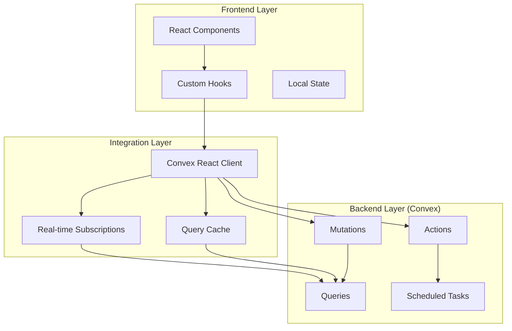
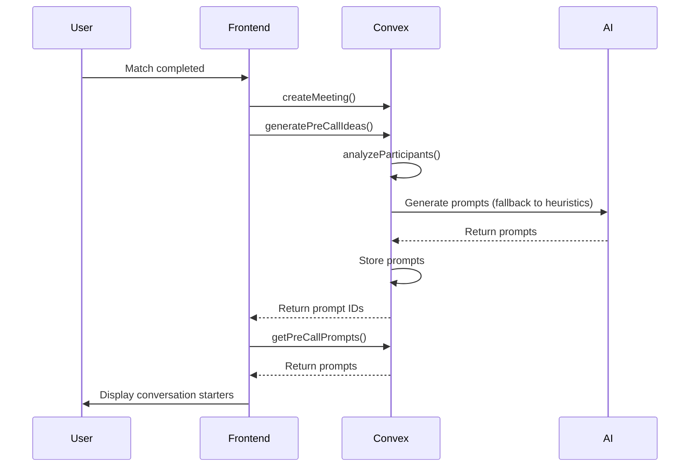
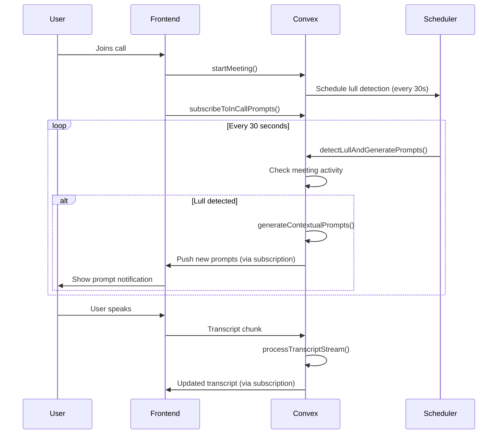
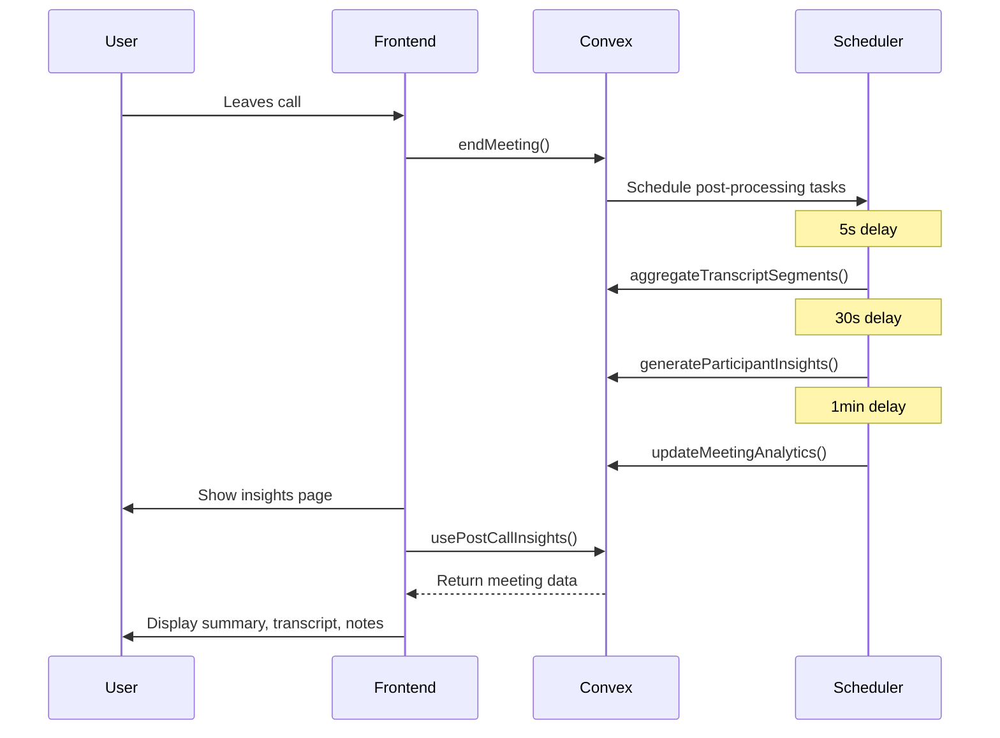

# Backend-Frontend Integration Plan
## AI Features Connection Strategy

> **Status**: Planning Phase  
> **Priority**: High - All features equally important  
> **Goal**: Connect all backend AI services to frontend components

---

## 📋 Executive Summary

This document outlines the comprehensive plan to connect all backend AI features to the frontend, enabling:
- **Pre-call Idea Generation**: AI-powered conversation starters
- **Real-time In-call Features**: Live prompts, transcription, and collaborative notes
- **Post-call Insights**: Meeting summaries and recommendations
- **Live Transcription**: Real-time speech-to-text display
- **Collaborative Notes**: Shared note-taking during meetings

---

## 🔍 Current State Analysis

### Backend Capabilities (Already Implemented)

#### 1. Pre-Call Features
- ✅ [`convex/prompts/actions.ts`](convex/prompts/actions.ts): `generatePreCallIdeas()`
- ✅ [`convex/prompts/queries.ts`](convex/prompts/queries.ts): `getPreCallPrompts()`
- ✅ Participant analysis and interest matching
- ✅ Heuristic and AI-based prompt generation

#### 2. In-Call Features
- ✅ [`convex/prompts/actions.ts`](convex/prompts/actions.ts): `detectLullAndGeneratePrompts()`
- ✅ [`convex/prompts/queries.ts`](convex/prompts/queries.ts): `subscribeToInCallPrompts()`
- ✅ [`convex/transcripts/streaming.ts`](convex/transcripts/streaming.ts): Real-time transcript processing
- ✅ [`convex/notes/mutations.ts`](convex/notes/mutations.ts): Operational transform for notes
- ✅ Speaking time analytics and lull detection

#### 3. Post-Call Features
- ✅ [`convex/meetings/postProcessing.ts`](convex/meetings/postProcessing.ts): `handleMeetingEnd()`
- ✅ [`convex/transcripts/aggregation.ts`](convex/transcripts/aggregation.ts): Transcript compilation
- ✅ Automated insight generation scheduling

### Frontend Gaps (Needs Implementation)

#### 1. Missing Custom Hooks
- ❌ `usePreCallPrompts` - Fetch and display pre-meeting prompts
- ❌ `useInCallPrompts` - Real-time prompt subscription
- ❌ `useTranscription` - Live transcription streaming
- ❌ `useCollaborativeNotes` - Real-time note sync
- ❌ `usePostCallInsights` - Meeting summary retrieval
- ❌ `useMeetingLifecycle` - Meeting state management

#### 2. Missing UI Components
- ❌ Pre-call prompt display card
- ❌ In-call prompt notification/overlay
- ❌ Live transcription panel
- ❌ Collaborative notes editor
- ❌ Post-call insights dashboard

#### 3. Existing Components Needing Integration
- 🔄 [`src/components/video-meeting/GetStreamVideoCall.tsx`](src/components/video-meeting/GetStreamVideoCall.tsx) - Add prompts, transcription, notes
- 🔄 [`src/components/mvp/meeting-room.tsx`](src/components/mvp/meeting-room.tsx) - Add feature panels
- 🔄 [`src/components/mvp/after-call-screen.tsx`](src/components/mvp/after-call-screen.tsx) - Replace hardcoded data
- 🔄 [`src/components/mvp/top-bar.tsx`](src/components/mvp/top-bar.tsx) - Show live prompt

---

## 🏗️ Integration Architecture



---

## 📝 Implementation Plan

### Phase 1: Custom React Hooks (Foundation)

Create reusable hooks in `src/hooks/` directory:

#### 1.1 `usePreCallPrompts.ts`
```typescript
/**
 * Hook for pre-call prompt generation and display
 * 
 * Features:
 * - Automatic prompt generation on meeting creation
 * - Feedback submission (used/dismissed/upvoted)
 * - Loading and error states
 */
export function usePreCallPrompts(meetingId: Id<"meetings">) {
  const prompts = useQuery(api.prompts.queries.getPreCallPrompts, { meetingId });
  const generatePrompts = useAction(api.prompts.actions.generatePreCallIdeas);
  const submitFeedback = useMutation(api.prompts.mutations.updatePromptFeedback);
  
  return {
    prompts,
    generatePrompts,
    submitFeedback,
    isLoading: prompts === undefined,
  };
}
```

**Backend APIs Used:**
- [`api.prompts.queries.getPreCallPrompts`](convex/prompts/queries.ts:44-90)
- [`api.prompts.actions.generatePreCallIdeas`](convex/prompts/actions.ts:27-146)
- [`api.prompts.mutations.updatePromptFeedback`](convex/prompts/mutations.ts)

#### 1.2 `useInCallPrompts.ts`
```typescript
/**
 * Hook for real-time in-call prompt subscriptions
 * 
 * Features:
 * - Real-time prompt updates via subscription
 * - Automatic lull detection triggers
 * - Prompt dismissal and usage tracking
 */
export function useInCallPrompts(meetingId: Id<"meetings">) {
  const subscription = useQuery(
    api.prompts.queries.subscribeToInCallPrompts,
    { meetingId }
  );
  const submitFeedback = useMutation(api.prompts.mutations.updatePromptFeedback);
  
  return {
    prompts: subscription?.prompts || [],
    lastUpdated: subscription?.lastUpdated,
    submitFeedback,
  };
}
```

**Backend APIs Used:**
- [`api.prompts.queries.subscribeToInCallPrompts`](convex/prompts/queries.ts:159-209)
- Triggered by: [`api.prompts.actions.detectLullAndGeneratePrompts`](convex/prompts/actions.ts:487-565)

#### 1.3 `useTranscription.ts`
```typescript
/**
 * Hook for live transcription streaming
 * 
 * Features:
 * - Real-time transcript chunks
 * - Speaker identification
 * - Confidence scores
 * - Search and filter capabilities
 */
export function useTranscription(meetingId: Id<"meetings">) {
  const segments = useQuery(api.transcripts.queries.getTranscriptSegments, {
    meetingId,
    limit: 100,
  });
  
  return {
    segments: segments || [],
    isLoading: segments === undefined,
  };
}
```

**Backend APIs Used:**
- [`api.transcripts.queries.getTranscriptSegments`](convex/transcripts/queries.ts:22-53)
- Stream processing: [`internal.transcripts.streaming.processTranscriptStream`](convex/transcripts/streaming.ts:23-181)

#### 1.4 `useCollaborativeNotes.ts`
```typescript
/**
 * Hook for collaborative note-taking with operational transforms
 * 
 * Features:
 * - Real-time note synchronization
 * - Offline operation queueing
 * - Conflict resolution via OT
 */
export function useCollaborativeNotes(meetingId: Id<"meetings">) {
  const notes = useQuery(api.notes.queries.getMeetingNotes, { meetingId });
  const applyOperation = useMutation(api.notes.mutations.applyNoteOperation);
  const batchApply = useMutation(api.notes.mutations.batchApplyNoteOperations);
  
  return {
    notes,
    applyOperation,
    batchApply,
    isLoading: notes === undefined,
  };
}
```

**Backend APIs Used:**
- [`api.notes.queries.getMeetingNotes`](convex/notes/queries.ts:16-30)
- [`api.notes.mutations.applyNoteOperation`](convex/notes/mutations.ts)
- [`api.notes.mutations.batchApplyNoteOperations`](convex/notes/mutations.ts)

#### 1.5 `usePostCallInsights.ts`
```typescript
/**
 * Hook for post-call insights and summaries
 * 
 * Features:
 * - Meeting summary retrieval
 * - Transcript access
 * - Action items and follow-ups
 */
export function usePostCallInsights(meetingId: Id<"meetings">) {
  const meeting = useQuery(api.meetings.queries.getMeeting, { meetingId });
  const transcriptSegments = useQuery(api.transcripts.queries.getTranscriptSegments, {
    meetingId,
  });
  const notes = useQuery(api.notes.queries.getMeetingNotes, { meetingId });
  
  return {
    meeting,
    transcriptSegments: transcriptSegments || [],
    notes,
    isLoading: meeting === undefined,
  };
}
```

**Backend APIs Used:**
- [`api.meetings.queries.getMeeting`](convex/meetings/queries.ts:92-129)
- [`api.transcripts.queries.getTranscriptSegments`](convex/transcripts/queries.ts:22-53)
- Post-processing: [`internal.meetings.postProcessing.handleMeetingEnd`](convex/meetings/postProcessing.ts:21-85)

#### 1.6 `useMeetingLifecycle.ts`
```typescript
/**
 * Hook for managing meeting lifecycle and triggering backend services
 * 
 * Features:
 * - Meeting creation with prompt generation
 * - Meeting state transitions
 * - Automatic post-call processing
 */
export function useMeetingLifecycle() {
  const createMeeting = useMutation(api.meetings.lifecycle.createMeeting);
  const startMeeting = useMutation(api.meetings.lifecycle.startMeeting);
  const endMeeting = useMutation(api.meetings.lifecycle.endMeeting);
  
  return {
    createMeeting,
    startMeeting,
    endMeeting,
  };
}
```

---

### Phase 2: Pre-Call Preparation Components

#### 2.1 `PreCallPromptsCard.tsx`
**Location**: `src/components/meeting/PreCallPromptsCard.tsx`

**Features**:
- Display AI-generated conversation starters
- Show relevance scores and tags
- Allow users to mark prompts as useful/dismissed
- Responsive card grid layout

**Integration Points**:
- Uses `usePreCallPrompts()` hook
- Connected to [`api.prompts.queries.getPreCallPrompts`](convex/prompts/queries.ts:44-90)

**UI Elements**:
```tsx
<Card>
  <CardHeader>
    <CardTitle>Conversation Starters</CardTitle>
    <CardDescription>AI-generated based on participant profiles</CardDescription>
  </CardHeader>
  <CardContent>
    {prompts.map(prompt => (
      <PromptItem
        key={prompt._id}
        content={prompt.content}
        tags={prompt.tags}
        relevance={prompt.relevance}
        onDismiss={() => submitFeedback({ promptId, feedback: "dismissed" })}
        onUpvote={() => submitFeedback({ promptId, feedback: "upvoted" })}
      />
    ))}
  </CardContent>
</Card>
```

#### 2.2 Integration into Meeting Pages
**Files to Update**:
- `src/app/[mvp]/call/[id]/page.tsx` - Add pre-call prep screen before join
- `src/components/queue/MatchNotification.tsx` - Show prompts after match

---

### Phase 3: In-Call Real-Time Features

#### 3.1 `InCallPromptsOverlay.tsx`
**Location**: `src/components/meeting/InCallPromptsOverlay.tsx`

**Features**:
- Toast-style notifications for new prompts
- Dismissable prompt cards
- Context-aware positioning (doesn't block video)
- Fade-in animation

**Integration Points**:
- Uses `useInCallPrompts()` hook with real-time subscription
- Connected to [`api.prompts.queries.subscribeToInCallPrompts`](convex/prompts/queries.ts:159-209)

**Trigger Mechanism**:
- Backend scheduler runs [`detectLullAndGeneratePrompts`](convex/prompts/actions.ts:487-565) every 30s
- New prompts automatically appear in UI via subscription

#### 3.2 `LiveTranscriptionPanel.tsx`
**Location**: `src/components/meeting/LiveTranscriptionPanel.tsx`

**Features**:
- Scrollable transcript view
- Speaker identification with colors
- Confidence indicator
- Auto-scroll to latest
- Search functionality

**Integration Points**:
- Uses `useTranscription()` hook
- Connected to [`api.transcripts.queries.getTranscriptSegments`](convex/transcripts/queries.ts:22-53)

**Real-time Updates**:
- Backend processes chunks via [`processTranscriptStream`](convex/transcripts/streaming.ts:23-181)
- Frontend subscribes to segment updates

#### 3.3 `CollaborativeNotesEditor.tsx`
**Location**: `src/components/meeting/CollaborativeNotesEditor.tsx`

**Features**:
- Rich text editor (Markdown support)
- Real-time sync across participants
- Offline operation queueing
- Cursor positions of other users

**Integration Points**:
- Uses `useCollaborativeNotes()` hook
- Connected to [`api.notes.mutations.applyNoteOperation`](convex/notes/mutations.ts)
- Operational Transform for conflict resolution

**Implementation**:
```tsx
const { notes, applyOperation } = useCollaborativeNotes(meetingId);

const handleTextChange = useCallback((operation) => {
  applyOperation({
    meetingId,
    operation,
    userId: currentUser._id,
  });
}, [meetingId, applyOperation]);
```

#### 3.4 Update `GetStreamVideoCall.tsx`
**File**: [`src/components/video-meeting/GetStreamVideoCall.tsx`](src/components/video-meeting/GetStreamVideoCall.tsx)

**Changes**:
1. Add side panel toggle for transcription/notes
2. Integrate `InCallPromptsOverlay`
3. Connect to meeting lifecycle hooks

```tsx
export function GetStreamVideoCall({ meetingId, ... }) {
  const [showTranscription, setShowTranscription] = useState(false);
  const [showNotes, setShowNotes] = useState(false);
  const inCallPrompts = useInCallPrompts(meetingId);
  
  return (
    <div className="flex h-full">
      <div className="flex-1">
        {/* Existing video layout */}
        <GetStreamVideoLayout />
        
        {/* NEW: Prompts overlay */}
        <InCallPromptsOverlay 
          prompts={inCallPrompts.prompts}
          onDismiss={inCallPrompts.submitFeedback}
        />
      </div>
      
      {/* NEW: Side panels */}
      {showTranscription && (
        <LiveTranscriptionPanel meetingId={meetingId} />
      )}
      {showNotes && (
        <CollaborativeNotesEditor meetingId={meetingId} />
      )}
    </div>
  );
}
```

---

### Phase 4: Post-Call Insights Dashboard

#### 4.1 Update `after-call-screen.tsx`
**File**: [`src/components/mvp/after-call-screen.tsx`](src/components/mvp/after-call-screen.tsx)

**Replace Hardcoded Data**:
```tsx
export function AfterCallScreen({ meetingId }: { meetingId: Id<"meetings"> }) {
  const insights = usePostCallInsights(meetingId);
  
  if (insights.isLoading) {
    return <LoadingSpinner />;
  }
  
  return (
    <div className="space-y-6">
      {/* Meeting Summary */}
      <MeetingSummaryCard 
        duration={insights.meeting?.duration}
        participants={insights.meeting?.participantCount}
      />
      
      {/* Transcript */}
      <TranscriptSection segments={insights.transcriptSegments} />
      
      {/* Notes */}
      <NotesSection notes={insights.notes} />
      
      {/* Action Items (extracted from notes/transcript) */}
      <ActionItemsSection meetingId={meetingId} />
    </div>
  );
}
```

#### 4.2 `MeetingSummaryCard.tsx`
**Features**:
- Duration, participants, topics discussed
- Key moments (high engagement segments)
- Speaking time distribution
- Download transcript/notes buttons

---

### Phase 5: Meeting Lifecycle Integration

#### 5.1 Trigger Pre-Call Prompt Generation
**When**: On meeting creation or match completion

**Location**: Update matching flow in `src/components/queue/`

```tsx
const handleMatchComplete = async (meetingId: Id<"meetings">) => {
  // Generate pre-call prompts
  await generatePreCallIdeas({ meetingId });
  
  // Navigate to pre-call screen
  router.push(`/meeting/${meetingId}/prepare`);
};
```

#### 5.2 Start Meeting Services
**When**: User joins video call

**Location**: `GetStreamVideoCall.tsx` join handler

```tsx
const handleJoinCall = async () => {
  await startMeeting({ meetingId });
  
  // Backend automatically:
  // - Initializes transcript streaming
  // - Starts lull detection scheduler
  // - Enables real-time note sync
  
  await join(); // GetStream join
};
```

#### 5.3 Trigger Post-Call Processing
**When**: User leaves call or call ends

**Location**: `GetStreamVideoCall.tsx` leave handler

```tsx
const handleLeaveCall = async () => {
  await leave(); // GetStream leave
  
  await endMeeting({ meetingId });
  
  // Backend automatically schedules:
  // - Transcript aggregation (5s delay)
  // - Insight generation (30s delay)
  // - Analytics update (1min delay)
  // - Resource cleanup (5min delay)
  
  // Navigate to post-call insights
  router.push(`/meeting/${meetingId}/insights`);
};
```

---

### Phase 6: Real-Time Subscriptions

#### 6.1 WebSocket Connection Management
**Convex automatically handles**:
- WebSocket connection lifecycle
- Automatic reconnection
- Query invalidation on updates

**Frontend Implementation**:
```tsx
// Subscription automatically updates when backend data changes
const inCallPrompts = useQuery(
  api.prompts.queries.subscribeToInCallPrompts,
  { meetingId }
);

// Component re-renders when new prompts arrive
useEffect(() => {
  if (inCallPrompts?.prompts.length) {
    toast.info('New conversation prompt available!');
  }
}, [inCallPrompts?.lastUpdated]);
```

#### 6.2 Optimistic Updates
**For notes editing**:
```tsx
const applyNoteOperation = useMutation(api.notes.mutations.applyNoteOperation);

const handleEdit = async (operation) => {
  // Apply locally first
  setLocalNotes(applyOperationLocally(localNotes, operation));
  
  // Then sync to backend
  try {
    await applyNoteOperation({ meetingId, operation });
  } catch (error) {
    // Rollback on error
    setLocalNotes(previousNotes);
  }
};
```

---

### Phase 7: Error Handling & Loading States

#### 7.1 Loading States
**Pattern**: Use Convex's `undefined` → `data` pattern

```tsx
function PreCallPromptsCard({ meetingId }) {
  const prompts = useQuery(api.prompts.queries.getPreCallPrompts, { meetingId });
  
  if (prompts === undefined) {
    return <CardSkeleton />;
  }
  
  if (prompts.length === 0) {
    return <EmptyState message="Generating prompts..." />;
  }
  
  return <PromptsDisplay prompts={prompts} />;
}
```

#### 7.2 Error Boundaries
**Create**: `src/components/ErrorBoundary.tsx`

```tsx
export function FeatureErrorBoundary({ children, feature }) {
  return (
    <ErrorBoundary
      fallback={(error) => (
        <Alert variant="destructive">
          <AlertTitle>Feature Unavailable</AlertTitle>
          <AlertDescription>
            {feature} is temporarily unavailable. {error.message}
          </AlertDescription>
        </Alert>
      )}
    >
      {children}
    </ErrorBoundary>
  );
}
```

#### 7.3 Graceful Degradation
**Strategy**: Features fail independently

```tsx
<MeetingRoom>
  <VideoArea /> {/* Core feature - always works */}
  
  <FeatureErrorBoundary feature="Prompts">
    <InCallPromptsOverlay />
  </FeatureErrorBoundary>
  
  <FeatureErrorBoundary feature="Transcription">
    <LiveTranscriptionPanel />
  </FeatureErrorBoundary>
  
  <FeatureErrorBoundary feature="Notes">
    <CollaborativeNotesEditor />
  </FeatureErrorBoundary>
</MeetingRoom>
```

---

### Phase 8: User Feedback Mechanisms

#### 8.1 Prompt Feedback System
**Features**:
- Thumbs up/down on prompts
- "Used this prompt" button
- Dismiss button
- Feedback stored in backend for ML training

**Backend API**: [`api.prompts.mutations.updatePromptFeedback`](convex/prompts/mutations.ts)

#### 8.2 Transcription Corrections
**Future Enhancement**:
- Allow users to correct transcription errors
- Store corrections for accuracy improvements
- Use for model fine-tuning

---

## 📂 File Structure

```
src/
├── hooks/
│   ├── usePreCallPrompts.ts         # NEW
│   ├── useInCallPrompts.ts          # NEW
│   ├── useTranscription.ts          # NEW
│   ├── useCollaborativeNotes.ts     # NEW
│   ├── usePostCallInsights.ts       # NEW
│   ├── useMeetingLifecycle.ts       # NEW
│   └── useWorkOSAuth.ts             # EXISTING
│
├── components/
│   ├── meeting/
│   │   ├── PreCallPromptsCard.tsx           # NEW
│   │   ├── InCallPromptsOverlay.tsx         # NEW
│   │   ├── LiveTranscriptionPanel.tsx       # NEW
│   │   ├── CollaborativeNotesEditor.tsx     # NEW
│   │   ├── MeetingSummaryCard.tsx           # NEW
│   │   ├── TranscriptSection.tsx            # NEW
│   │   └── ActionItemsSection.tsx           # NEW
│   │
│   ├── video-meeting/
│   │   └── GetStreamVideoCall.tsx   # UPDATE
│   │
│   └── mvp/
│       ├── after-call-screen.tsx    # UPDATE
│       ├── meeting-room.tsx         # UPDATE
│       └── top-bar.tsx              # UPDATE
│
└── app/
    └── [mvp]/
        └── call/
            └── [id]/
                ├── prepare/
                │   └── page.tsx     # NEW - Pre-call prep
                ├── page.tsx         # UPDATE - In-call
                └── insights/
                    └── page.tsx     # NEW - Post-call
```

---

## 🔄 Data Flow Diagrams

### Pre-Call Flow


### In-Call Flow


### Post-Call Flow


---

## ✅ Testing Strategy

### Unit Tests
- Test custom hooks in isolation
- Mock Convex queries/mutations
- Test error handling paths

### Integration Tests
- Test hook → component integration
- Verify real-time subscriptions
- Test optimistic updates

### End-to-End Tests
1. **Pre-Call Flow**:
   - Match users → Generate prompts → Display prompts
   
2. **In-Call Flow**:
   - Join call → Detect lull → Show prompt
   - Speak → Generate transcript → Display transcript
   - Type notes → Sync → Show in other user's view

3. **Post-Call Flow**:
   - End call → Wait for processing → View insights

---

## 📊 Performance Considerations

### Frontend Optimizations
1. **Lazy Loading**: Load transcription/notes panels only when opened
2. **Virtualization**: Use virtual scrolling for long transcripts
3. **Debouncing**: Debounce note operations before sending to backend
4. **Caching**: Leverage Convex's built-in query caching

### Backend Optimizations (Already Implemented)
1. **Batching**: Transcript chunks processed in batches
2. **Coalescing**: Rapid updates coalesced to reduce database writes
3. **Backpressure**: Automatic throttling when overloaded
4. **Indexing**: Proper database indexes for fast queries

---

## 🚀 Deployment Checklist

### Environment Variables
```env
# Already configured
NEXT_PUBLIC_CONVEX_URL=
CONVEX_DEPLOYMENT=
NEXT_PUBLIC_STREAM_API_KEY=
STREAM_SECRET=

# Verify these exist
WORKOS_API_KEY=
WORKOS_CLIENT_ID=
```

### Feature Flags (Optional)
Create toggles for gradual rollout:
```typescript
const FEATURES = {
  preCallPrompts: true,
  inCallPrompts: true,
  liveTranscription: true,
  collaborativeNotes: true,
  postCallInsights: true,
};
```

---

## 📝 Documentation Requirements

### For Developers
1. Hook usage examples in Storybook
2. Component prop documentation
3. Backend API reference (already exists in convex/types/)

### For Users
1. Feature introduction tooltips
2. Help center articles
3. Video tutorials

---

## 🎯 Success Metrics

### Technical Metrics
- [ ] All 5 feature categories integrated
- [ ] Real-time latency < 500ms
- [ ] Error rate < 1%
- [ ] Test coverage > 80%

### User Metrics
- [ ] Prompt usage rate > 30%
- [ ] Notes created in > 50% of meetings
- [ ] Transcript viewed by > 40% of users
- [ ] Post-call insights viewed > 60%

---

## 🔧 Maintenance Plan

### Regular Tasks
- Monitor error rates in Convex dashboard
- Review prompt quality and adjust heuristics
- Update AI models as needed
- Optimize database queries

### Quarterly Reviews
- Analyze feature usage metrics
- Gather user feedback
- Plan enhancements
- Update documentation

---

## 📞 Support & Escalation

### Common Issues

#### "Prompts not appearing"
- Check meeting state is "scheduled" or "active"
- Verify participant profiles have data
- Check Convex function logs

#### "Transcription delayed"
- Check GetStream webhook configuration
- Verify transcript streaming metrics
- Review backpressure settings

#### "Notes not syncing"
- Check WebSocket connection status
- Verify operational transform logic
- Review offline queue status

---

## 🎓 Learning Resources

### Convex Documentation
- [Queries](https://docs.convex.dev/functions/queries)
- [Mutations](https://docs.convex.dev/functions/mutations)
- [Actions](https://docs.convex.dev/functions/actions)
- [Scheduling](https://docs.convex.dev/scheduling)
- [Real-time Subscriptions](https://docs.convex.dev/client/react)

### GetStream Integration
- [Video SDK Docs](https://getstream.io/video/docs/)
- [Recording Guide](https://getstream.io/video/docs/recording/)
- [Transcription Guide](https://getstream.io/video/docs/transcription/)

---

## 📅 Implementation Timeline

### Week 1-2: Foundation
- Create all custom hooks
- Set up error boundaries
- Add loading states

### Week 3-4: Pre-Call & Post-Call
- Build pre-call prompts UI
- Integrate post-call insights
- Connect meeting lifecycle

### Week 5-6: In-Call Features
- Add prompts overlay
- Build transcription panel
- Implement notes editor

### Week 7-8: Polish & Testing
- Integration testing
- Performance optimization
- Bug fixes
- Documentation

---

## ✨ Future Enhancements

### Phase 2 Features
- AI-powered meeting summaries (natural language)
- Sentiment analysis visualization
- Topic extraction and tagging
- Meeting highlights video clips
- Integration with calendar apps
- Mobile app support

### Advanced Features
- Multi-language transcription
- Custom prompt templates
- Meeting analytics dashboard
- Integration with CRM systems
- AI meeting assistant (voice commands)

---

**Document Version**: 1.0  
**Last Updated**: 2025-01-30  
**Status**: Ready for Implementation  
**Next Steps**: Review plan → Create hooks → Build components