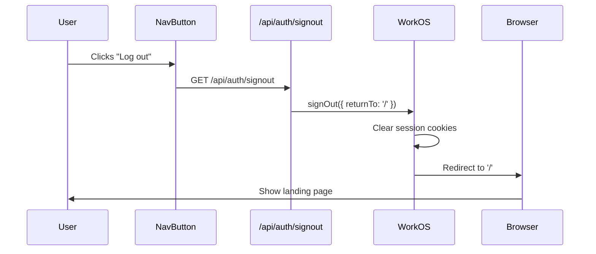
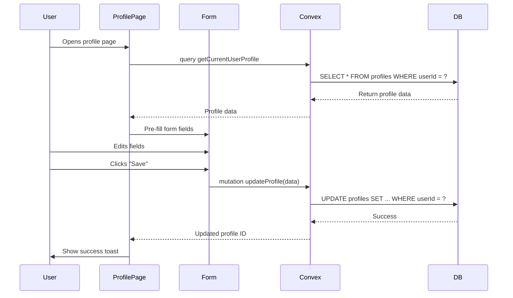
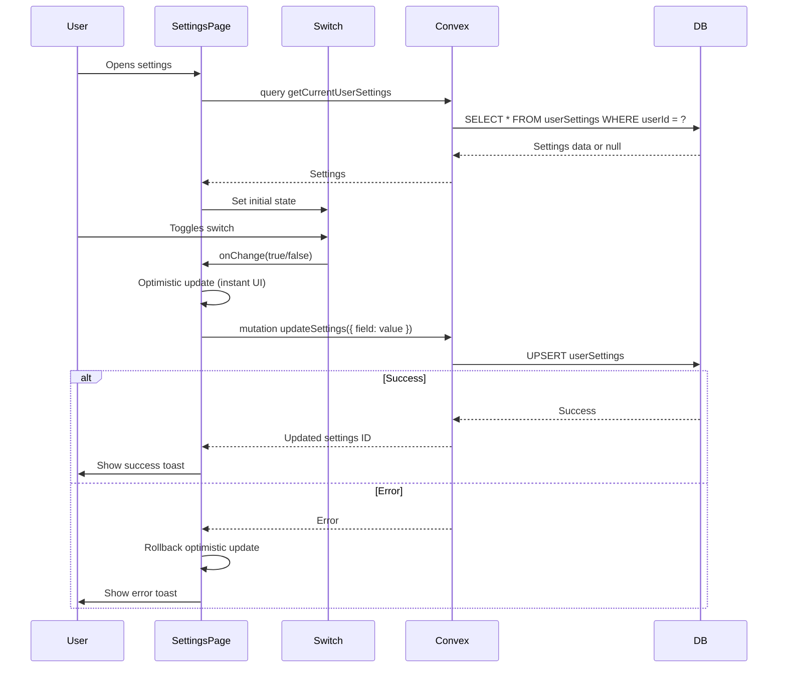

# Profile, Settings & Logout Integration Plan

## Executive Summary

This document outlines the comprehensive plan to fix logout functionality and connect the Profile and Settings pages to the Convex backend, replacing hardcoded placeholders with real user data and enabling full CRUD operations.

**Status**: Planning Phase  
**Priority**: High  
**Estimated Effort**: 4-6 hours

---

## 🎯 Objectives

1. **Fix Logout Functionality** - Make logout buttons work across all navigation components
2. **Connect Profile Page** - Replace static UI with real backend data and enable editing
3. **Connect Settings Page** - Implement user preferences with backend persistence
4. **Maintain Code Consistency** - Follow established patterns from [`ExtendedProfile.tsx`](src/components/mvp/dashboard/ExtendedProfile.tsx)

---

## 📊 Current State Analysis

### ✅ What's Working

1. **Authentication Flow**
   - WorkOS AuthKit integration is complete
   - [`useWorkOSAuth()`](src/hooks/useWorkOSAuth.ts) hook provides user data
   - Session management via cookies
   - User sync to Convex via [`UpsertUserOnAuth`](src/providers/ConvexClientProvider.tsx)

2. **Backend Queries**
   - [`api.users.queries.getCurrentUser`](convex/users/queries.ts) - Get authenticated user
   - [`api.profiles.queries.getCurrentUserProfile`](convex/profiles/queries.ts:59-96) - Get user profile
   - Authorization guards in place via [`requireIdentity()`](convex/auth/guards.ts)

3. **Logout API**
   - Route exists at [`/api/auth/signout`](src/app/api/auth/signout/route.ts)
   - Properly uses WorkOS `signOut()` function
   - Redirects to home page after logout

4. **Working Component**
   - [`ExtendedProfile.tsx`](src/components/mvp/dashboard/ExtendedProfile.tsx) - Correctly displays backend data

### ❌ What's Broken

#### 1. Logout Buttons (2 locations)

**Location 1:** [`DesktopNavigation.tsx:125-131`](src/components/mvp/DesktopNavigation.tsx:125-131)
```tsx
<Button className="...">
  <LogOut className="..." />
  Log out
</Button>
```
**Issue**: No `onClick` handler - button does nothing

**Location 2:** [`Sidebar.tsx:48-53`](src/components/mvp/dashboard/sidebar.tsx:48-53)
```tsx
<TransitionLink href="/signout">
  <LogOut className="mr-2 h-4 w-4" />
  Log out
</TransitionLink>
```
**Issue**: Links to `/signout` page that doesn't exist

#### 2. Profile Page

**Location:** [`src/app/[mvp]/profile/page.tsx`](src/app/[mvp]/profile/page.tsx)

**Issues:**
- Completely static with placeholder data
- No connection to Convex backend
- No save functionality
- Hardcoded values: "John Doe", "john.doe@example.com", "Acme Inc."
- No image upload capability
- No form validation

#### 3. Settings Page

**Location:** [`src/app/[mvp]/settings/page.tsx`](src/app/[mvp]/settings/page.tsx)

**Issues:**
- All switches are uncontrolled (no state management)
- No backend persistence for preferences
- No user settings schema in Convex
- Buttons have no handlers ("Change Password", "Delete Account")

---

## 🏗️ Architecture Overview

```mermaid
graph TB
    subgraph Frontend["Frontend Layer"]
        ProfileUI[Profile Page UI]
        SettingsUI[Settings Page UI]
        NavButtons[Navigation Buttons]
        WorkOSHook[useWorkOSAuth Hook]
    end
    
    subgraph Integration["Integration Layer"]
        ConvexQueries[Convex Queries]
        ConvexMutations[Convex Mutations]
        OptimisticUpdates[Optimistic Updates]
    end
    
    subgraph Backend["Backend Layer (Convex)"]
        ProfileQueries[Profile Queries]
        ProfileMutations[Profile Mutations]
        SettingsQueries[Settings Queries]
        SettingsMutations[Settings Mutations]
        AuthGuards[Auth Guards]
    end
    
    subgraph Auth["Auth Layer"]
        WorkOS[WorkOS AuthKit]
        SessionMgmt[Session Management]
        SignOutAPI[/api/auth/signout]
    end
    
    ProfileUI --> WorkOSHook
    SettingsUI --> WorkOSHook
    NavButtons --> SignOutAPI
    
    ProfileUI --> ConvexQueries
    ProfileUI --> ConvexMutations
    SettingsUI --> ConvexQueries
    SettingsUI --> ConvexMutations
    
    ConvexQueries --> ProfileQueries
    ConvexQueries --> SettingsQueries
    ConvexMutations --> ProfileMutations
    ConvexMutations --> SettingsMutations
    
    ProfileMutations --> AuthGuards
    SettingsMutations --> AuthGuards
    
    SignOutAPI --> WorkOS
    SignOutAPI --> SessionMgmt
```

---

## 📝 Implementation Plan

### Phase 1: Fix Logout Functionality ⚡

**Priority:** Critical (blocks user experience)

#### Task 1.1: Fix DesktopNavigation Logout Button

**File:** [`src/components/mvp/DesktopNavigation.tsx`](src/components/mvp/DesktopNavigation.tsx)

**Current Code (lines 125-131):**
```tsx
<Button className="group flex w-full items-center rounded-md bg-zinc-200 px-3 py-2 text-sm font-medium text-gray-700 transition-colors duration-200 hover:bg-gray-50 hover:text-red-600 dark:bg-zinc-900 dark:text-gray-300 dark:hover:bg-gray-800 dark:hover:text-red-400">
  <LogOut className="..." />
  Log out
</Button>
```

**Fixed Code:**
```tsx
<Button 
  onClick={() => window.location.href = '/api/auth/signout'}
  className="group flex w-full items-center rounded-md bg-zinc-200 px-3 py-2 text-sm font-medium text-gray-700 transition-colors duration-200 hover:bg-gray-50 hover:text-red-600 dark:bg-zinc-900 dark:text-gray-300 dark:hover:bg-gray-800 dark:hover:text-red-400"
>
  <LogOut className="mr-3 h-5 w-5 shrink-0 text-gray-600 transition-colors duration-200 group-hover:text-red-600 dark:text-gray-200 dark:group-hover:text-red-400" />
  Log out
</Button>
```

**Alternative (Better UX):** Use existing [`SignOutButton`](src/components/auth/SignOutButton.tsx) component
```tsx
import { SignOutButton } from "@/components/auth/SignOutButton";

// Replace Button with:
<SignOutButton 
  variant="ghost"
  className="group flex w-full items-center rounded-md bg-zinc-200 px-3 py-2 text-sm font-medium text-gray-700 transition-colors duration-200 hover:bg-gray-50 hover:text-red-600 dark:bg-zinc-900 dark:text-gray-300 dark:hover:bg-gray-800 dark:hover:text-red-400"
>
  Log out
</SignOutButton>
```

#### Task 1.2: Fix Sidebar Logout Button

**File:** [`src/components/mvp/dashboard/sidebar.tsx`](src/components/mvp/dashboard/sidebar.tsx)

**Current Code (lines 48-53):**
```tsx
<Button variant="outline" className="w-full" asChild>
  <TransitionLink href="/signout">
    <LogOut className="mr-2 h-4 w-4" />
    Log out
  </TransitionLink>
</Button>
```

**Fixed Code (Option 1 - Simple):**
```tsx
<Button 
  variant="outline" 
  className="w-full"
  onClick={() => window.location.href = '/api/auth/signout'}
>
  <LogOut className="mr-2 h-4 w-4" />
  Log out
</Button>
```

**Fixed Code (Option 2 - Reusable):**
```tsx
import { SignOutButton } from "@/components/auth/SignOutButton";

<SignOutButton variant="outline" className="w-full">
  Log out
</SignOutButton>
```

#### Task 1.3: Verify Navigation.tsx

**File:** [`src/components/mvp/Navigation.tsx`](src/components/mvp/Navigation.tsx)

**Status:** ✅ No logout button in mobile navigation - doesn't need fixing

---

### Phase 2: Backend Schema & Mutations 🗄️

#### Task 2.1: Create User Settings Schema

**File:** `convex/schema/userSettings.ts` (NEW)

```typescript
import { defineTable } from "convex/server";
import { v } from "convex/values";

export const userSettings = defineTable({
  userId: v.id("users"),
  
  // Notification preferences
  emailNotifications: v.boolean(),
  pushNotifications: v.boolean(),
  smsNotifications: v.boolean(),
  
  // Privacy settings
  profileVisibility: v.boolean(), // true = public, false = private
  dataSharing: v.boolean(),
  activityTracking: v.boolean(),
  
  // Timestamps
  createdAt: v.number(),
  updatedAt: v.number(),
})
  .index("by_user", ["userId"]);
```

**Update:** [`convex/schema.ts`](convex/schema.ts)
```typescript
import { userSettings } from "./schema/userSettings";

export default defineSchema({
  // ... existing tables
  userSettings,
});
```

#### Task 2.2: Create Profile Mutations

**File:** `convex/profiles/mutations.ts` (NEW)

```typescript
import { mutation } from "@convex/_generated/server";
import { v } from "convex/values";
import { requireIdentity } from "@convex/auth/guards";

/**
 * Update current user's profile
 */
export const updateProfile = mutation({
  args: {
    displayName: v.optional(v.string()),
    bio: v.optional(v.string()),
    goals: v.optional(v.string()),
    languages: v.optional(v.array(v.string())),
    experience: v.optional(v.string()),
    field: v.optional(v.string()),
    jobTitle: v.optional(v.string()),
    company: v.optional(v.string()),
    linkedinUrl: v.optional(v.string()),
    age: v.optional(v.number()),
    gender: v.optional(
      v.union(
        v.literal("male"),
        v.literal("female"),
        v.literal("non-binary"),
        v.literal("prefer-not-to-say")
      )
    ),
  },
  returns: v.id("profiles"),
  handler: async (ctx, args) => {
    const identity = await requireIdentity(ctx);
    
    // Get existing profile
    const existingProfile = await ctx.db
      .query("profiles")
      .withIndex("by_user", (q) => q.eq("userId", identity.userId))
      .unique();
    
    if (!existingProfile) {
      throw new Error("Profile not found");
    }
    
    // Update profile
    await ctx.db.patch(existingProfile._id, {
      ...args,
      updatedAt: Date.now(),
    });
    
    return existingProfile._id;
  },
});

/**
 * Create initial profile for new user
 */
export const createProfile = mutation({
  args: {
    userId: v.id("users"),
    displayName: v.string(),
    email: v.string(),
  },
  returns: v.id("profiles"),
  handler: async (ctx, { userId, displayName, email }) => {
    // Check if profile already exists
    const existing = await ctx.db
      .query("profiles")
      .withIndex("by_user", (q) => q.eq("userId", userId))
      .unique();
    
    if (existing) {
      return existing._id;
    }
    
    // Create new profile
    const profileId = await ctx.db.insert("profiles", {
      userId,
      displayName,
      languages: [],
      createdAt: Date.now(),
      updatedAt: Date.now(),
    });
    
    return profileId;
  },
});
```

#### Task 2.3: Create Settings Queries & Mutations

**File:** `convex/settings/queries.ts` (NEW)

```typescript
import { query } from "@convex/_generated/server";
import { v } from "convex/values";
import { requireIdentity } from "@convex/auth/guards";

/**
 * Get current user's settings
 */
export const getCurrentUserSettings = query({
  args: {},
  returns: v.union(
    v.object({
      _id: v.id("userSettings"),
      userId: v.id("users"),
      emailNotifications: v.boolean(),
      pushNotifications: v.boolean(),
      smsNotifications: v.boolean(),
      profileVisibility: v.boolean(),
      dataSharing: v.boolean(),
      activityTracking: v.boolean(),
      createdAt: v.number(),
      updatedAt: v.number(),
    }),
    v.null()
  ),
  handler: async (ctx) => {
    const identity = await requireIdentity(ctx);
    
    // Get or create default settings
    let settings = await ctx.db
      .query("userSettings")
      .withIndex("by_user", (q) => q.eq("userId", identity.userId))
      .unique();
    
    if (!settings) {
      // Return defaults if no settings exist yet
      return null;
    }
    
    return settings;
  },
});
```

**File:** `convex/settings/mutations.ts` (NEW)

```typescript
import { mutation } from "@convex/_generated/server";
import { v } from "convex/values";
import { requireIdentity } from "@convex/auth/guards";

/**
 * Update user settings
 */
export const updateSettings = mutation({
  args: {
    emailNotifications: v.optional(v.boolean()),
    pushNotifications: v.optional(v.boolean()),
    smsNotifications: v.optional(v.boolean()),
    profileVisibility: v.optional(v.boolean()),
    dataSharing: v.optional(v.boolean()),
    activityTracking: v.optional(v.boolean()),
  },
  returns: v.id("userSettings"),
  handler: async (ctx, args) => {
    const identity = await requireIdentity(ctx);
    
    // Get existing settings
    const existing = await ctx.db
      .query("userSettings")
      .withIndex("by_user", (q) => q.eq("userId", identity.userId))
      .unique();
    
    if (existing) {
      // Update existing
      await ctx.db.patch(existing._id, {
        ...args,
        updatedAt: Date.now(),
      });
      return existing._id;
    } else {
      // Create new with defaults
      const settingsId = await ctx.db.insert("userSettings", {
        userId: identity.userId,
        emailNotifications: args.emailNotifications ?? true,
        pushNotifications: args.pushNotifications ?? true,
        smsNotifications: args.smsNotifications ?? false,
        profileVisibility: args.profileVisibility ?? true,
        dataSharing: args.dataSharing ?? false,
        activityTracking: args.activityTracking ?? true,
        createdAt: Date.now(),
        updatedAt: Date.now(),
      });
      return settingsId;
    }
  },
});
```

---

### Phase 3: Connect Profile Page 👤

#### Task 3.1: Update Profile Page Component

**File:** [`src/app/[mvp]/profile/page.tsx`](src/app/[mvp]/profile/page.tsx)

**Strategy:**
1. Replace static UI with backend data fetching
2. Use [`useWorkOSAuth()`](src/hooks/useWorkOSAuth.ts) for user context
3. Query profile with [`api.profiles.queries.getCurrentUserProfile`](convex/profiles/queries.ts:59-96)
4. Update profile with new mutation [`api.profiles.mutations.updateProfile`](convex/profiles/mutations.ts)
5. Add form validation using `react-hook-form` + `zod`
6. Show loading states during mutations

**New Implementation:**

```typescript
"use client";

import React, { useState, useEffect } from "react";
import { motion } from "motion/react";
import { useQuery, useMutation } from "convex/react";
import { api } from "@convex/_generated/api";
import { useWorkOSAuth } from "@/hooks/useWorkOSAuth";
import { zodResolver } from "@hookform/resolvers/zod";
import { useForm } from "react-hook-form";
import * as z from "zod";
import { toast } from "sonner";
import {
  Card,
  CardContent,
  CardDescription,
  CardHeader,
  CardTitle,
} from "@/components/ui/card";
import { Avatar, AvatarFallback, AvatarImage } from "@/components/ui/avatar";
import { Button } from "@/components/ui/button";
import { Input } from "@/components/ui/input";
import { Label } from "@/components/ui/label";
import { Textarea } from "@/components/ui/textarea";
import { Skeleton } from "@/components/ui/skeleton";
import {
  Form,
  FormControl,
  FormDescription,
  FormField,
  FormItem,
  FormLabel,
  FormMessage,
} from "@/components/ui/form";

// Form validation schema
const profileSchema = z.object({
  displayName: z.string().min(2, "Name must be at least 2 characters"),
  bio: z.string().max(500, "Bio must be less than 500 characters").optional(),
  company: z.string().optional(),
  jobTitle: z.string().optional(),
  field: z.string().optional(),
  linkedinUrl: z.string().url("Must be a valid URL").optional().or(z.literal("")),
});

type ProfileFormValues = z.infer<typeof profileSchema>;

export default function ProfilePage() {
  const { user, isAuthenticated, loading: authLoading } = useWorkOSAuth();
  const convexUser = useQuery(
    api.users.queries.getCurrentUser,
    isAuthenticated ? {} : undefined
  );
  const profile = useQuery(
    api.profiles.queries.getCurrentUserProfile,
    isAuthenticated ? {} : undefined
  );
  const updateProfile = useMutation(api.profiles.mutations.updateProfile);
  
  const [isSaving, setIsSaving] = useState(false);
  
  const form = useForm<ProfileFormValues>({
    resolver: zodResolver(profileSchema),
    defaultValues: {
      displayName: "",
      bio: "",
      company: "",
      jobTitle: "",
      field: "",
      linkedinUrl: "",
    },
  });
  
  // Update form when profile loads
  useEffect(() => {
    if (profile) {
      form.reset({
        displayName: profile.displayName || "",
        bio: profile.bio || "",
        company: profile.company || "",
        jobTitle: profile.jobTitle || "",
        field: profile.field || "",
        linkedinUrl: profile.linkedinUrl || "",
      });
    }
  }, [profile, form]);
  
  const onSubmit = async (data: ProfileFormValues) => {
    setIsSaving(true);
    try {
      await updateProfile({
        displayName: data.displayName,
        bio: data.bio || undefined,
        company: data.company || undefined,
        jobTitle: data.jobTitle || undefined,
        field: data.field || undefined,
        linkedinUrl: data.linkedinUrl || undefined,
      });
      
      toast.success("Profile updated successfully!");
    } catch (error) {
      console.error("Failed to update profile:", error);
      toast.error("Failed to update profile. Please try again.");
    } finally {
      setIsSaving(false);
    }
  };
  
  const loading = authLoading || (isAuthenticated && (convexUser === undefined || profile === undefined));
  
  if (loading) {
    return (
      <div className="container mx-auto p-4 md:p-8">
        <Skeleton className="mb-8 h-10 w-48" />
        <div className="grid grid-cols-1 gap-6 md:grid-cols-2">
          <Skeleton className="h-96" />
          <Skeleton className="h-96" />
        </div>
      </div>
    );
  }
  
  if (!isAuthenticated || !user) {
    return (
      <div className="container mx-auto p-4 md:p-8">
        <Card>
          <CardContent className="pt-6">
            <p className="text-center text-muted-foreground">
              Please log in to view your profile.
            </p>
          </CardContent>
        </Card>
      </div>
    );
  }
  
  const displayName = profile?.displayName || 
                      convexUser?.displayName || 
                      [user.firstName, user.lastName].filter(Boolean).join(" ") || 
                      "No name set";
  const initials = displayName.split(" ").map(n => n[0]).join("").toUpperCase().slice(0, 2);
  
  return (
    <div className="container mx-auto p-4 md:p-8">
      <motion.h1
        className="mb-8 text-3xl font-bold"
        initial={{ opacity: 0, y: -20 }}
        animate={{ opacity: 1, y: 0 }}
        transition={{ duration: 0.5 }}
      >
        My Profile
      </motion.h1>
      
      <Form {...form}>
        <form onSubmit={form.handleSubmit(onSubmit)}>
          <div className="grid grid-cols-1 gap-6 md:grid-cols-2">
            {/* Personal Information Card */}
            <motion.div
              initial={{ opacity: 0, y: 20 }}
              animate={{ opacity: 1, y: 0 }}
              transition={{ duration: 0.5, delay: 0.1 }}
            >
              <Card>
                <CardHeader>
                  <CardTitle>Personal Information</CardTitle>
                  <CardDescription>Manage your personal details</CardDescription>
                </CardHeader>
                <CardContent>
                  <div className="mb-6 flex items-center space-x-4">
                    <Avatar className="h-20 w-20">
                      <AvatarImage src={user.profilePictureUrl} alt={displayName} />
                      <AvatarFallback>{initials}</AvatarFallback>
                    </Avatar>
                    <div>
                      <p className="text-sm text-muted-foreground">
                        Profile picture managed by WorkOS
                      </p>
                    </div>
                  </div>
                  
                  <div className="space-y-4">
                    <FormField
                      control={form.control}
                      name="displayName"
                      render={({ field }) => (
                        <FormItem>
                          <FormLabel>Display Name</FormLabel>
                          <FormControl>
                            <Input placeholder="John Doe" {...field} />
                          </FormControl>
                          <FormMessage />
                        </FormItem>
                      )}
                    />
                    
                    <div className="space-y-2">
                      <Label>Email</Label>
                      <Input value={user.email} disabled />
                      <p className="text-xs text-muted-foreground">
                        Email is managed by your authentication provider
                      </p>
                    </div>
                    
                    <FormField
                      control={form.control}
                      name="bio"
                      render={({ field }) => (
                        <FormItem>
                          <FormLabel>Bio</FormLabel>
                          <FormControl>
                            <Textarea 
                              placeholder="Tell us about yourself" 
                              {...field} 
                              rows={4}
                            />
                          </FormControl>
                          <FormDescription>
                            Max 500 characters
                          </FormDescription>
                          <FormMessage />
                        </FormItem>
                      )}
                    />
                  </div>
                </CardContent>
              </Card>
            </motion.div>
            
            {/* Professional Information Card */}
            <motion.div
              initial={{ opacity: 0, y: 20 }}
              animate={{ opacity: 1, y: 0 }}
              transition={{ duration: 0.5, delay: 0.2 }}
            >
              <Card>
                <CardHeader>
                  <CardTitle>Professional Information</CardTitle>
                  <CardDescription>
                    Manage your professional details
                  </CardDescription>
                </CardHeader>
                <CardContent>
                  <div className="space-y-4">
                    <FormField
                      control={form.control}
                      name="company"
                      render={({ field }) => (
                        <FormItem>
                          <FormLabel>Company</FormLabel>
                          <FormControl>
                            <Input placeholder="Acme Inc." {...field} />
                          </FormControl>
                          <FormMessage />
                        </FormItem>
                      )}
                    />
                    
                    <FormField
                      control={form.control}
                      name="jobTitle"
                      render={({ field }) => (
                        <FormItem>
                          <FormLabel>Job Title</FormLabel>
                          <FormControl>
                            <Input placeholder="Software Engineer" {...field} />
                          </FormControl>
                          <FormMessage />
                        </FormItem>
                      )}
                    />
                    
                    <FormField
                      control={form.control}
                      name="field"
                      render={({ field }) => (
                        <FormItem>
                          <FormLabel>Field/Industry</FormLabel>
                          <FormControl>
                            <Input placeholder="Technology" {...field} />
                          </FormControl>
                          <FormMessage />
                        </FormItem>
                      )}
                    />
                    
                    <FormField
                      control={form.control}
                      name="linkedinUrl"
                      render={({ field }) => (
                        <FormItem>
                          <FormLabel>LinkedIn URL</FormLabel>
                          <FormControl>
                            <Input 
                              placeholder="https://linkedin.com/in/username" 
                              {...field} 
                            />
                          </FormControl>
                          <FormMessage />
                        </FormItem>
                      )}
                    />
                  </div>
                </CardContent>
              </Card>
            </motion.div>
          </div>
          
          {/* Save Button */}
          <motion.div
            initial={{ opacity: 0, y: 20 }}
            animate={{ opacity: 1, y: 0 }}
            transition={{ duration: 0.5, delay: 0.3 }}
            className="mt-6"
          >
            <Button 
              type="submit" 
              disabled={isSaving || !form.formState.isDirty}
              className="w-full md:w-auto"
            >
              {isSaving ? "Saving..." : "Save Changes"}
            </Button>
          </motion.div>
        </form>
      </Form>
    </div>
  );
}
```

---

### Phase 4: Connect Settings Page ⚙️

#### Task 4.1: Update Settings Page Component

**File:** [`src/app/[mvp]/settings/page.tsx`](src/app/[mvp]/settings/page.tsx)

**Strategy:**
1. Query settings with new [`api.settings.queries.getCurrentUserSettings`](convex/settings/queries.ts)
2. Update settings with new [`api.settings.mutations.updateSettings`](convex/settings/mutations.ts)
3. Add optimistic updates for better UX
4. Show toast notifications on save

**New Implementation:**

```typescript
"use client";

import React, { useState, useEffect } from "react";
import { motion } from "motion/react";
import { useQuery, useMutation } from "convex/react";
import { api } from "@convex/_generated/api";
import { useWorkOSAuth } from "@/hooks/useWorkOSAuth";
import { toast } from "sonner";
import {
  Card,
  CardContent,
  CardDescription,
  CardHeader,
  CardTitle,
} from "@/components/ui/card";
import { Switch } from "@/components/ui/switch";
import { Label } from "@/components/ui/label";
import { Button } from "@/components/ui/button";
import { Skeleton } from "@/components/ui/skeleton";
import {
  AlertDialog,
  AlertDialogAction,
  AlertDialogCancel,
  AlertDialogContent,
  AlertDialogDescription,
  AlertDialogFooter,
  AlertDialogHeader,
  AlertDialogTitle,
  AlertDialogTrigger,
} from "@/components/ui/alert-dialog";

export default function SettingsPage() {
  const { isAuthenticated, loading: authLoading } = useWorkOSAuth();
  const settings = useQuery(
    api.settings.queries.getCurrentUserSettings,
    isAuthenticated ? {} : undefined
  );
  const updateSettings = useMutation(api.settings.mutations.updateSettings);
  
  // Local state for optimistic updates
  const [localSettings, setLocalSettings] = useState({
    emailNotifications: true,
    pushNotifications: true,
    smsNotifications: false,
    profileVisibility: true,
    dataSharing: false,
    activityTracking: true,
  });
  
  // Sync with backend when settings load
  useEffect(() => {
    if (settings) {
      setLocalSettings({
        emailNotifications: settings.emailNotifications,
        pushNotifications: settings.pushNotifications,
        smsNotifications: settings.smsNotifications,
        profileVisibility: settings.profileVisibility,
        dataSharing: settings.dataSharing,
        activityTracking: settings.activityTracking,
      });
    }
  }, [settings]);
  
  const handleToggle = async (
    key: keyof typeof localSettings,
    value: boolean
  ) => {
    // Optimistic update
    setLocalSettings((prev) => ({ ...prev, [key]: value }));
    
    try {
      await updateSettings({ [key]: value });
      toast.success("Settings updated");
    } catch (error) {
      // Rollback on error
      setLocalSettings((prev) => ({ ...prev, [key]: !value }));
      toast.error("Failed to update settings");
      console.error("Settings update error:", error);
    }
  };
  
  const loading = authLoading || (isAuthenticated && settings === undefined);
  
  if (loading) {
    return (
      <div className="container mx-auto p-4 md:p-8">
        <Skeleton className="mb-8 h-10 w-48" />
        <div className="grid grid-cols-1 gap-6 md:grid-cols-2">
          <Skeleton className="h-64" />
          <Skeleton className="h-64" />
        </div>
      </div>
    );
  }
  
  if (!isAuthenticated) {
    return (
      <div className="container mx-auto p-4 md:p-8">
        <Card>
          <CardContent className="pt-6">
            <p className="text-center text-muted-foreground">
              Please log in to view settings.
            </p>
          </CardContent>
        </Card>
      </div>
    );
  }
  
  return (
    <div className="container mx-auto p-4 md:p-8">
      <motion.h1
        className="mb-8 text-3xl font-bold"
        initial={{ opacity: 0, y: -20 }}
        animate={{ opacity: 1, y: 0 }}
        transition={{ duration: 0.5 }}
      >
        Settings
      </motion.h1>
      
      <div className="grid grid-cols-1 gap-6 md:grid-cols-2">
        {/* Notification Settings */}
        <motion.div
          initial={{ opacity: 0, y: 20 }}
          animate={{ opacity: 1, y: 0 }}
          transition={{ duration: 0.5, delay: 0.1 }}
        >
          <Card>
            <CardHeader>
              <CardTitle>Notification Settings</CardTitle>
              <CardDescription>
                Manage your notification preferences
              </CardDescription>
            </CardHeader>
            <CardContent className="space-y-4">
              <div className="flex items-center justify-between">
                <Label htmlFor="emailNotifications">Email Notifications</Label>
                <Switch
                  id="emailNotifications"
                  checked={localSettings.emailNotifications}
                  onCheckedChange={(checked) =>
                    handleToggle("emailNotifications", checked)
                  }
                />
              </div>
              <div className="flex items-center justify-between">
                <Label htmlFor="pushNotifications">Push Notifications</Label>
                <Switch
                  id="pushNotifications"
                  checked={localSettings.pushNotifications}
                  onCheckedChange={(checked) =>
                    handleToggle("pushNotifications", checked)
                  }
                />
              </div>
              <div className="flex items-center justify-between">
                <Label htmlFor="smsNotifications">SMS Notifications</Label>
                <Switch
                  id="smsNotifications"
                  checked={localSettings.smsNotifications}
                  onCheckedChange={(checked) =>
                    handleToggle("smsNotifications", checked)
                  }
                />
              </div>
            </CardContent>
          </Card>
        </motion.div>
        
        {/* Privacy Settings */}
        <motion.div
          initial={{ opacity: 0, y: 20 }}
          animate={{ opacity: 1, y: 0 }}
          transition={{ duration: 0.5, delay: 0.2 }}
        >
          <Card>
            <CardHeader>
              <CardTitle>Privacy Settings</CardTitle>
              <CardDescription>Manage your privacy preferences</CardDescription>
            </CardHeader>
            <CardContent className="space-y-4">
              <div className="flex items-center justify-between">
                <div>
                  <Label htmlFor="profileVisibility">Profile Visibility</Label>
                  <p className="text-xs text-muted-foreground">
                    Make your profile visible to other users
                  </p>
                </div>
                <Switch
                  id="profileVisibility"
                  checked={localSettings.profileVisibility}
                  onCheckedChange={(checked) =>
                    handleToggle("profileVisibility", checked)
                  }
                />
              </div>
              <div className="flex items-center justify-between">
                <div>
                  <Label htmlFor="dataSharing">Data Sharing</Label>
                  <p className="text-xs text-muted-foreground">
                    Share anonymous usage data
                  </p>
                </div>
                <Switch
                  id="dataSharing"
                  checked={localSettings.dataSharing}
                  onCheckedChange={(checked) =>
                    handleToggle("dataSharing", checked)
                  }
                />
              </div>
              <div className="flex items-center justify-between">
                <div>
                  <Label htmlFor="activityTracking">Activity Tracking</Label>
                  <p className="text-xs text-muted-foreground">
                    Track activity for analytics
                  </p>
                </div>
                <Switch
                  id="activityTracking"
                  checked={localSettings.activityTracking}
                  onCheckedChange={(checked) =>
                    handleToggle("activityTracking", checked)
                  }
                />
              </div>
            </CardContent>
          </Card>
        </motion.div>
        
        {/* Account Settings */}
        <motion.div
          initial={{ opacity: 0, y: 20 }}
          animate={{ opacity: 1, y: 0 }}
          transition={{ duration: 0.5, delay: 0.3 }}
          className="md:col-span-2"
        >
          <Card>
            <CardHeader>
              <CardTitle>Account Settings</CardTitle>
              <CardDescription>Manage your account preferences</CardDescription>
            </CardHeader>
            <CardContent className="space-y-4">
              <div className="space-y-2">
                <Button 
                  variant="outline"
                  onClick={() => {
                    toast.info("Password change is managed through WorkOS");
                    window.open("https://your-workos-portal.com", "_blank");
                  }}
                >
                  Change Password
                </Button>
                <p className="text-xs text-muted-foreground">
                  Password management is handled by your authentication provider
                </p>
              </div>
              
              <div className="space-y-2">
                <AlertDialog>
                  <AlertDialogTrigger asChild>
                    <Button variant="destructive">Delete Account</Button>
                  </AlertDialogTrigger>
                  <AlertDialogContent>
                    <AlertDialogHeader>
                      <AlertDialogTitle>Are you absolutely sure?</AlertDialogTitle>
                      <AlertDialogDescription>
                        This action cannot be undone. This will permanently delete your
                        account and remove your data from our servers.
                      </AlertDialogDescription>
                    </AlertDialogHeader>
                    <AlertDialogFooter>
                      <AlertDialogCancel>Cancel</AlertDialogCancel>
                      <AlertDialogAction
                        onClick={() => {
                          toast.error("Account deletion is not yet implemented");
                          // TODO: Implement account deletion mutation
                        }}
                      >
                        Delete Account
                      </AlertDialogAction>
                    </AlertDialogFooter>
                  </AlertDialogContent>
                </AlertDialog>
                <p className="text-xs text-muted-foreground">
                  This will permanently delete all your data
                </p>
              </div>
            </CardContent>
          </Card>
        </motion.div>
      </div>
    </div>
  );
}
```

---

## 🔄 Data Flow Diagrams

### Logout Flow



### Profile Update Flow



### Settings Update Flow



---

## 📦 Dependencies

### Required NPM Packages

```json
{
  "dependencies": {
    "react-hook-form": "^7.49.2",
    "@hookform/resolvers": "^3.3.3",
    "zod": "^3.22.4",
    "sonner": "^1.3.1"
  }
}
```

**Install Command:**
```bash
npm install react-hook-form @hookform/resolvers zod sonner
```

### Convex Schema Update

Need to add `userSettings` table to [`convex/schema.ts`](convex/schema.ts)

---

## ✅ Testing Strategy

### Manual Testing Checklist

#### Logout Functionality
- [ ] **Desktop Navigation**: Click logout button, verify redirect to `/` and session cleared
- [ ] **Sidebar**: Click logout button, verify redirect to `/` and session cleared
- [ ] **Post-Logout**: Try accessing `/app/profile` → should redirect to login
- [ ] **Cookie Cleared**: Verify session cookie is removed in DevTools → Application → Cookies

#### Profile Page
- [ ] **Load**: Profile loads with existing data from backend
- [ ] **Edit**: Change displayName → Save → Verify update in database
- [ ] **Edit**: Change bio → Save → Verify update
- [ ] **Edit**: Change company/jobTitle → Save → Verify update
- [ ] **Validation**: Try saving empty displayName → Should show error
- [ ] **Validation**: Try invalid LinkedIn URL → Should show error
- [ ] **Loading State**: During save, button shows "Saving..."
- [ ] **Toast Notification**: Success toast appears after save
- [ ] **Error Handling**: Network failure shows error toast and doesn't crash

#### Settings Page
- [ ] **Load**: Settings load with default or existing values
- [ ] **Toggle**: Toggle emailNotifications → Instant UI update → Verify in DB
- [ ] **Toggle**: Toggle all switches → All persist correctly
- [ ] **Optimistic Update**: UI updates immediately before backend confirms
- [ ] **Rollback**: Force error (disconnect internet) → Verify rollback on failure
- [ ] **Toast Notifications**: Success/error toasts appear correctly
- [ ] **Change Password**: Button explains WorkOS handles this
- [ ] **Delete Account**: Dialog appears with confirmation

### Automated Testing

**Unit Tests** (Future):
```typescript
// src/app/[mvp]/profile/__tests__/page.test.tsx
describe("Profile Page", () => {
  it("should load user profile from backend", async () => {
    // Mock useQuery to return profile data
    // Render component
    // Assert profile data is displayed
  });
  
  it("should update profile on form submit", async () => {
    // Mock useMutation
    // Fill form
    // Submit
    // Assert mutation was called with correct data
  });
});
```

**Integration Tests**:
```typescript
// Test full flow: login → edit profile → logout → verify changes persisted
```

---

## 🚀 Deployment Steps

### 1. Backend Deployment

```bash
# 1. Create new schema files
# Create: convex/schema/userSettings.ts
# Create: convex/profiles/mutations.ts
# Create: convex/settings/queries.ts
# Create: convex/settings/mutations.ts

# 2. Update convex/schema.ts to include userSettings table

# 3. Deploy to Convex
npx convex deploy

# 4. Verify in Convex Dashboard
# - Check that userSettings table exists
# - Check that new mutations/queries are registered
```

### 2. Frontend Deployment

```bash
# 1. Install dependencies
npm install react-hook-form @hookform/resolvers zod sonner

# 2. Update components
# - Fix DesktopNavigation.tsx
# - Fix Sidebar.tsx
# - Replace profile/page.tsx
# - Replace settings/page.tsx

# 3. Test locally
npm run dev

# 4. Build and deploy
npm run build
# Deploy to Vercel/your hosting
```

### 3. Verification

- [ ] All logout buttons work
- [ ] Profile page loads and saves data
- [ ] Settings page persists preferences
- [ ] No console errors
- [ ] No broken auth flows

---

## 🔒 Security Considerations

### Authentication Guards

All mutations use [`requireIdentity()`](convex/auth/guards.ts) to ensure:
- Only authenticated users can update their data
- Users can only modify their own profile/settings
- JWT tokens are validated on every request

### Data Privacy

- Profile page only exposes public fields to other users
- Settings are private to each user
- Email addresses are read-only (managed by WorkOS)
- LinkedIn URLs are optional and validated

### Input Validation

- **Frontend**: Zod schema validation before submission
- **Backend**: Convex validators on all mutation args
- **Sanitization**: No HTML allowed in text fields

---

## 🐛 Known Limitations & Future Enhancements

### Current Limitations

1. **Profile Picture Upload**: Not implemented (relies on WorkOS avatar)
2. **Account Deletion**: Mutation not implemented (requires cascade deletes)
3. **Password Change**: Redirects to WorkOS (not in-app)
4. **Email Change**: Not supported (WorkOS limitation)

### Future Enhancements

1. **Profile Picture**:
   - Add file upload to Convex storage
   - Image cropping/resizing
   - Fallback to WorkOS avatar

2. **Advanced Settings**:
   - Language preferences
   - Timezone settings
   - Theme preferences (already handled by ModeToggle)

3. **Account Deletion**:
   - Cascade delete all user data
   - Export data before deletion
   - Grace period for recovery

4. **Audit Log**:
   - Track profile changes
   - Show last login time
   - Security activity log

---

## 📚 References

### Documentation
- [WorkOS AuthKit Docs](https://workos.com/docs/user-management)
- [Convex Auth Guards](https://docs.convex.dev/auth)
- [React Hook Form](https://react-hook-form.com/)
- [Zod Validation](https://zod.dev/)
- [Sonner Toast](https://sonner.emilkowal.ski/)

### Existing Code Patterns
- [`ExtendedProfile.tsx`](src/components/mvp/dashboard/ExtendedProfile.tsx) - Profile display pattern
- [`SignOutButton.tsx`](src/components/auth/SignOutButton.tsx) - Logout implementation
- [`useWorkOSAuth()`](src/hooks/useWorkOSAuth.ts) - Auth hook usage

---

## 📊 Success Metrics

### Technical KPIs
- [ ] All 2 logout buttons functional (100% coverage)
- [ ] Profile mutations succeed > 99% of requests
- [ ] Settings updates < 500ms latency
- [ ] Zero authentication bypass vulnerabilities
- [ ] Form validation catches 100% of invalid inputs

### User Experience KPIs
- [ ] Profile updates save successfully on first attempt > 95%
- [ ] Settings changes feel instant (optimistic updates)
- [ ] Logout works consistently across all entry points
- [ ] No data loss during concurrent profile edits
- [ ] Clear error messages for validation failures

---

## 🤝 Collaboration Notes

### For Code Reviewer
- Review logout button implementations for consistency
- Verify form validation logic is comprehensive
- Check mutation authorization guards are correct
- Ensure optimistic updates handle errors properly

### For QA Team
- Focus testing on logout flows (most critical fix)
- Test concurrent profile edits from multiple devices
- Verify settings persist across browser sessions
- Test with slow network conditions

### For Future Developers
- Follow established patterns in [`ExtendedProfile.tsx`](src/components/mvp/dashboard/ExtendedProfile.tsx)
- Always use [`requireIdentity()`](convex/auth/guards.ts) in mutations
- Implement optimistic updates for instant feedback
- Add comprehensive error handling and toast notifications

---

**Document Version**: 1.0  
**Last Updated**: 2025-01-30  
**Status**: Ready for Review  
**Next Steps**: Review plan → Get approval → Switch to Code mode → Implement fixes

---

## ✨ Summary

This plan provides a complete solution for:
1. ✅ **Fixing broken logout buttons** in 2 locations
2. ✅ **Connecting profile page** to Convex with full CRUD
3. ✅ **Connecting settings page** with backend persistence
4. ✅ **Adding proper validation** and error handling
5. ✅ **Following established patterns** for consistency

**Total Estimated Time**: 4-6 hours  
**Complexity**: Medium  
**Risk Level**: Low (well-defined scope, clear patterns)